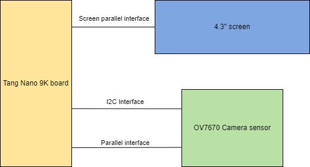
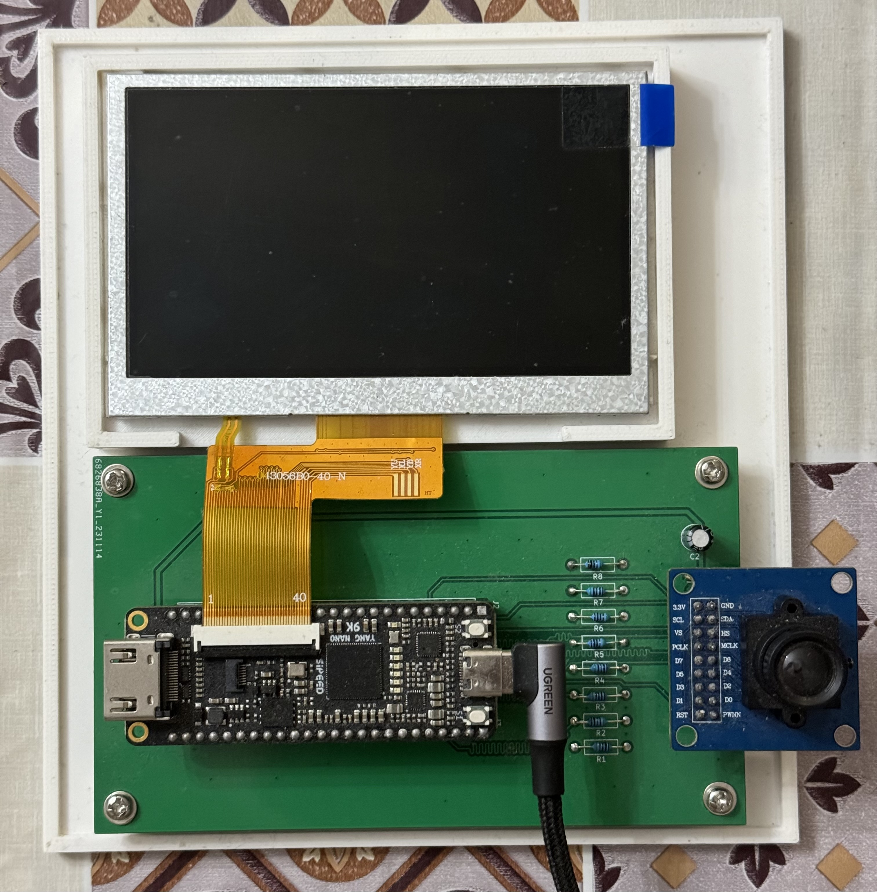
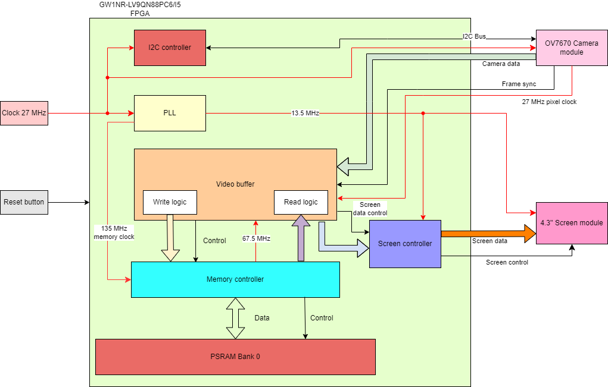

# tang_nano_9K_ov7670
This is OV7670 camera sensor demo project for Tang Nano 9K board.

## Hardware setup
Below you can find main components diagram.

Here we have Tang Nano 9K development board, 4.3'' LCD screen and OV7670 camera sensor.
The whole system powered through USB cable. The fully assembled setup is on the photo.

Here I added 3D-printed plastic holder to hold on all components together and
a simple PCB for interconnect between camera module and Tang Nano board.

You can find OpenSCAD file of plastic holder and STL model [here](physical).

## System description

Figure below shows high level representation of the system.

## How to build

## Working demo

Here is a short video to demonstrate how the whole setup is working.

https://github.com/phoenix367/tang_nano_9K_ov7670/assets/2589419/772c0f9f-d9df-424a-a7af-923fc6d49a3e

## Known issues

* Incorrect image resize
* Resistors are used for 

## License

Source code and model files are distributed under MIT license. See the full license
text in the [LICENSE](LICENSE) file.
