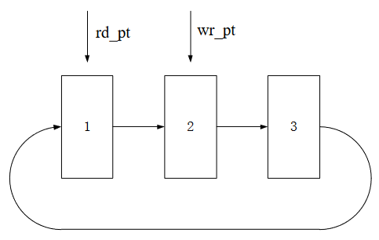

# tang_nano_9K_ov7670
This is OV7670 camera sensor demo project for Tang Nano 9K board. In this
project the development board is using to capture video from OV7670 sensor
and show it on 4.3" LCD screen in real time. Additional on-the-flight image
resize is applied to save aspect ratio of the input video.

## Hardware setup
Below you can find main components diagram.

Here we have Tang Nano 9K development board, 4.3'' LCD screen and OV7670 camera sensor.
The whole system powered through USB cable. The fully assembled setup is on the photo.

Here I added 3D-printed plastic holder to hold on all components together and
a simple PCB for interconnect between camera module and Tang Nano board.

You can find OpenSCAD file of plastic holder and STL model [here](physical).

## System description

Figure below shows high level representation of the system.

Here we have tree clock signals:
* main clock 27 MHz
* Memory clock 135 MHz
* LCD screen clock 13.5 MHz

I2C controller is used for camera module initial configuration. You can refer
to [ov7670_default.sv](src/ov7670_default.sv) file for configuration details.

Video buffer implements circular buffer for 3 frames. Frames have 640x480 size 
with 16-bit RGB565 pixels. Clock frequency for video buffer logi is 67.5 MHz.

The image below describes more detailed the video buffer.

The buffer logic is very similar to implemented in Gowin Video Frame buffer IP.
The main steps are following:

The read pointer is represented by rd_pt, and the write pointer is represented by wr_pt.

1. Both read and write pointers are cyclic in the order of frame 1, frame 2,
frame 3.
2. rd_pt points to the next frame when one frame of data has been read.
3. wr_pt points to the next frame when one frame of data has been written.
4. After the initial reset, both read and write pointers start from frame 1.
5. When read is faster than write, it will be adjusted by repeating read
frame, i.e., the output frame rate is larger than the input frame rate, and
the switching of the read pointer is faster than that of the write pointer.
As shown in figure above, when a frame of data is read, rd_pt should be
switched from frame 1 to frame 2, if it is found that wr_pt is still in frame
2, then rd_pt still stops at frame 1, and read the data from frame 1, i.e.,
repeating frame 1 data one time.
6. When write is faster than read, it will be adjusted by writing a new
frame to overwrite the previous frame, i.e., the input frame rate is
greater than the output frame rate, and the switching of write pointer is
faster than that of the read pointer. As shown in figure above, when one
frame of data is written, wr_pt is to be switched to frame 3 from frame 2;
at this time, frame 3 is not occupied, then wr_pt is switched to frame 3
to write the data; because write is fast, after writing a frame of data,
wr_pt should be switched to frame 1 from frame 3; if it is found that
rd_pt is still in frame 1, then rd_pt still stops at frame 3, then the data is
still written to frame 3 buffer, overwriting the previously written data.
7. When the read and write rates are the same, i.e., the output frame rate
is equal to the input frame rate, then the read pointer will always follow
the write pointer, switching at the same rate.

The arbiter circuit is to receive and arbitrate the memory read/write
access requests from the input line buffer control circuit and the output line
buffer control circuit. At the same time, the data interface of input line buffer
control circuit and output line buffer control circuit is connected to memory controller.

Here memory controller is a Gowin PSRAM IP instance.

## How to build

To build the sample design you need to install Gowin IDE ver. 1.9.9 Beta-4 or
later. After that you need to download project source code by the following command

`
git clone --recurse-submodules https://github.com/phoenix367/tang_nano_9K_ov7670.git
`

and open the projet in Gowin FPGA designer IDE. You may use Gowin Programmer to upload generated FS file
to the board.

To build and run tests you need the following:
* CMake ver. 3.17 or later;
* Icarus verilog ver. 12-20220611 (you can download Windows version from [here](https://bleyer.org/icarus/iverilog-v12-20220611-x64_setup.exe)).

Testbench is working only on Windows OS. Below is the instruction how to generate and run tests:
1. Generate testbench project with the following command

`
cmake -D IVerilog_PATH=<bin_folder> <build output>
`

Here `bin_folder` is a path to Icarus verilog binary folder.
For example `C:\iverilog\bin`. If you would like to analyze internal states of each test
you can turn on variables dump with option `DUMP_SIM_VARIABLES=ON`. In this case after test
run dump file will be generated and you can analyze it with GtkWave of similar software. Dump file
is saved to `<build_output>\sim\tests\<test_name>\dump.vcd`.

2. Run tests with your target toolchain. For example if you selected Visual Studio 2019 as a project target
you need to open generated project in Visual Studio and just build "RUN ALL" target.

## Working demo

Here is a short video to demonstrate how the whole setup is working.

https://github.com/phoenix367/tang_nano_9K_ov7670/assets/2589419/772c0f9f-d9df-424a-a7af-923fc6d49a3e

## Known issues

* Incorrect image resize (only vertical resize was implemented).
* Resistors are used for logic level converting. Need to replace them to specialized chip.

## License

Source code and model files are distributed under MIT license. See the full license
text in the [LICENSE](LICENSE) file.
