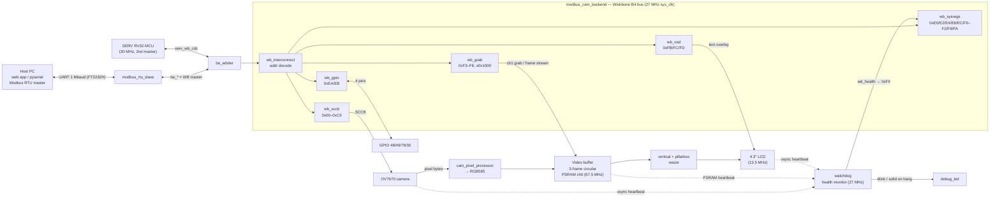
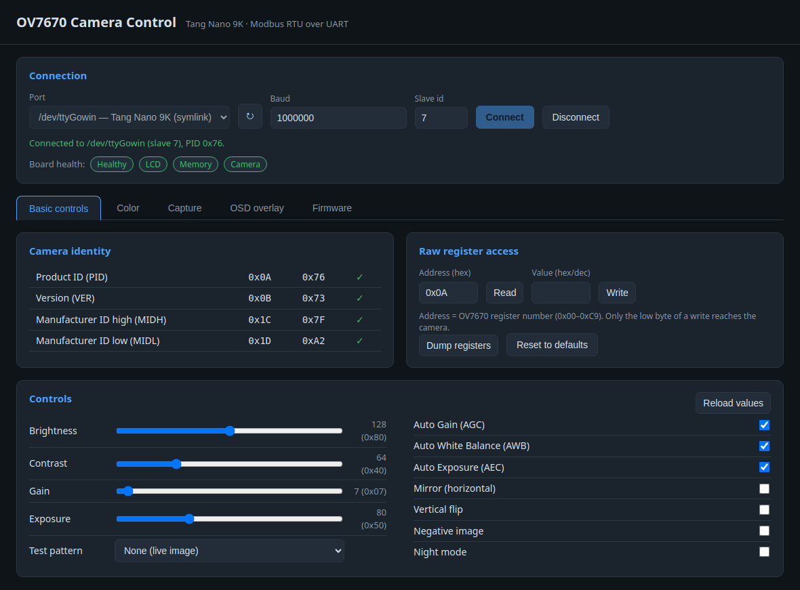

# tang_nano_9K_ov7670
This is OV7670 camera sensor demo project for Tang Nano 9K board. In this
project the development board is using to capture video from OV7670 sensor
and show it on 4.3" LCD screen in real time. The 640×480 capture is
resized on the fly to fit the 480×272 LCD with full aspect-preserving
(pillarbox) output: a vertical downscale plus a horizontal downscale of
the whole row, centred with black side borders.

> **A significant upgrade of the old Tang Nano 9K OV7670 camera demo.**
> This version was developed with the help of the
> [Claude Code](https://claude.com/claude-code) AI assistant and goes well
> beyond the original "capture and display" demo, adding:
>
> - **Host integration via Modbus** — a Modbus RTU server (over a Wishbone bus
>   on the FPGA) lets a PC read/write live camera registers and download full
>   frames over USB; a companion web app drives it.
> - **Runtime camera control** — tune OV7670 registers on the fly (exposure,
>   colour, test patterns, …) without rebuilding the bitstream.
> - **On-the-fly frame resizing** — aspect-preserving 640×480 → 480×272
>   downscale with pillarbox borders, done in hardware in the video path.
> - **On-screen display (OSD)** — a host-controlled text overlay rendered on
>   the LCD (60×17 character grid): the host enables it and writes characters
>   over Modbus, with a hardware clear sweep.
> - **Device health checking** — an on-chip watchdog monitors the camera,
>   memory and LCD subsystems and reports health to the host (and a status LED).
> - **Programmable RISC-V co-processor** — a [SERV](https://github.com/olofk/serv)
>   bit-serial RV32 soft core runs as a 2nd master on the same Wishbone bus; the
>   host uploads firmware **overlays at runtime** (no reflash) via a bootloader
>   mailbox. Bundled demos: motion detection, a floating-point calculator, and an
>   on-device face-presence classifier.
> - **On-device ML face presence** — [`roi_tm`](demo_mcu_apps/roi_tm/) classifies
>   face / no-face in a fixed region of interest with a **Tsetlin Machine** (purely
>   bitwise inference) on the soft core, trained offline on a host pipeline.
> - **Bidirectional GPIO** — 4 general-purpose pins on the Wishbone bus,
>   controllable from both the host (Modbus) and the SERV core.

The frame geometry (input/screen size, emit row size) is configured in
[`platform.json`](platform.json), from which CMake generates the
SystemVerilog header `src/platform_config.vh` used by the design.

## Hardware setup
Below you can find main components diagram.


Here we have Tang Nano 9K development board, 4.3'' LCD screen and OV7670 camera sensor.
The whole system powered through USB cable. The fully assembled setup is on the photo.


Here I added 3D-printed plastic holder to hold on all components together and
a simple PCB for interconnect between camera module and Tang Nano board.

You can find OpenSCAD file of plastic holder and STL model [here](physical).


## System description

Figure below shows high level representation of the system.


The 27 MHz host control plane (the "Modbus server" block above) is a **Wishbone
bus**; the diagram below zooms into it:


```mermaid
flowchart LR
    CAM["OV7670 camera"] -->|"pixel bytes"| PIX["cam_pixel_processor<br/>→ RGB565"]
    PIX --> VB["Video buffer<br/>3-frame circular<br/>PSRAM ch0 (67.5 MHz)"]
    VB --> RSZ["vertical + pillarbox<br/>resize"] --> LCD["4.3&quot; LCD<br/>(13.5 MHz)"]

    APP["Host PC<br/>web app / pyserial<br/>Modbus RTU master"]
    APP <-->|"UART 1 Mbaud (FT2232H)"| MB["modbus_rtu_slave"]

    subgraph WB["modbus_cam_backend — Wishbone B4 bus (27 MHz sys_clk)"]
        IC["wb_interconnect<br/>addr decode"]
        IC --> SCCB["wb_sccb<br/>0x00–0xC9"]
        IC --> SYS["wb_sysregs<br/>0xE0/E2/E4/E8/EC/F0–F2/F9/FA"]
        IC --> GRAB["wb_grab<br/>0xF3–F8, ≥0x1000"]
        IC --> WOSD["wb_osd<br/>0xFB/FC/FD"]
        IC --> WGPIO["wb_gpio<br/>0xEA/EB"]
    end

    MB <-->|"be_* = WB master"| ARBM["be_arbiter"]
    ARBM --> IC
    MCU["SERV RV32 MCU<br/>(30 MHz, 2nd master)"] <-->|"serv_wb_cdc"| ARBM
    SCCB -->|"SCCB"| CAM
    GRAB -->|"ch1 grab / frame stream"| VB
    WOSD -->|"text overlay"| LCD
    WGPIO <-->|"4 pins"| PINS["GPIO 48/49/76/30"]

    WD["watchdog<br/>health monitor (27 MHz)"]
    CAM -.->|"vsync heartbeat"| WD
    VB -.->|"PSRAM heartbeat"| WD
    LCD -.->|"vsync heartbeat"| WD
    WD -->|"wd_health → 0xF9"| SYS
    WD -->|"blink / solid on hang"| DBG["debug_led"]
```

Here we have tree clock signals:
* main clock 27 MHz
* Memory clock 135 MHz
* LCD screen clock 13.5 MHz

I2C controller is used for camera module initial configuration. You can refer
to [ov7670_default.sv](src/ov7670_default.sv) file for configuration details.
After power-on init, the host control plane (live camera registers, status,
frame grab/download, and the OSD overlay) runs over a **Wishbone B4
classic-standard bus** on the 27 MHz clock: the Modbus slave's backend handshake
is the bus master, and `modbus_cam_backend` decodes it to five peripheral slaves
(`wb_sccb`, `wb_sysregs`, `wb_grab`, `wb_osd`, `wb_gpio`). On a SERV build a second
RV32 master (the soft core, via `serv_wb_cdc` + `be_arbiter`) shares the same bus.
See [doc/modbus_server.md](doc/modbus_server.md) and [doc/serv.md](doc/serv.md).

Video buffer implements circular buffer for 3 frames. Frames have 640x480 size 
with 16-bit RGB565 pixels. Clock frequency for video buffer logi is 67.5 MHz.

The image below describes more detailed the video buffer.


The buffer logic is very similar to implemented in Gowin Video Frame buffer IP.
The main steps are following:

The read pointer is represented by rd_pt, and the write pointer is represented by wr_pt.

1. Both read and write pointers are cyclic in the order of frame 1, frame 2,
frame 3.
2. rd_pt points to the next frame when one frame of data has been read.
3. wr_pt points to the next frame when one frame of data has been written.
4. After the initial reset, both read and write pointers start from frame 1.
5. When read is faster than write, it will be adjusted by repeating read
frame, i.e., the output frame rate is larger than the input frame rate, and
the switching of the read pointer is faster than that of the write pointer.
As shown in figure above, when a frame of data is read, rd_pt should be
switched from frame 1 to frame 2, if it is found that wr_pt is still in frame
2, then rd_pt still stops at frame 1, and read the data from frame 1, i.e.,
repeating frame 1 data one time.
6. When write is faster than read, it will be adjusted by writing a new
frame to overwrite the previous frame, i.e., the input frame rate is
greater than the output frame rate, and the switching of write pointer is
faster than that of the read pointer. As shown in figure above, when one
frame of data is written, wr_pt is to be switched to frame 3 from frame 2;
at this time, frame 3 is not occupied, then wr_pt is switched to frame 3
to write the data; because write is fast, after writing a frame of data,
wr_pt should be switched to frame 1 from frame 3; if it is found that
rd_pt is still in frame 1, then rd_pt still stops at frame 3, then the data is
still written to frame 3 buffer, overwriting the previously written data.
7. When the read and write rates are the same, i.e., the output frame rate
is equal to the input frame rate, then the read pointer will always follow
the write pointer, switching at the same rate.

The arbiter circuit is to receive and arbitrate the memory read/write
access requests from the input line buffer control circuit and the output line
buffer control circuit. At the same time, the data interface of input line buffer
control circuit and output line buffer control circuit is connected to memory controller.

Here memory controller is a Gowin PSRAM IP instance.

## Host control (Modbus + web app)

A **Modbus RTU server** built into the FPGA exposes the **live OV7670 registers**
over the on-board USB-UART (`/dev/ttyGowin`, 1 Mbaud 8-E-1, slave id 7). The
holding-register address maps **1:1** to the camera register number
(`0x00`–`0xC9`), so a host reads/writes the camera over SCCB in real time —
adjust brightness, gain, white balance, gamma, the color matrix, mirror/flip,
test patterns, and more, without rebuilding.

Beyond live register tuning, the bridge can also **grab a full 640×480 frame**
into the second PSRAM channel and stream it back to the host, exposes a hardware
**health watchdog** (LCD / memory / camera) on both a debug LED and a status
register, and supports **reset-to-defaults** (re-running the power-on camera
init) on command.

A bundled **Flask web app** ([`webapp/`](webapp/)) gives a point-and-click panel
for all of this — live controls, a gamma-curve plot and color-matrix editor,
board-health indicators, a frame-grab/download tab, and a one-click register
dump (JSON). `scripts/modbus_test.py` / `scripts/frame_grab.py` are CLIs for
scripting.



See **[doc/host_control.md](doc/host_control.md)** for the register map, status
registers, watchdog, frame grab, and LED map, and
**[doc/webapp_manual.md](doc/webapp_manual.md)** for the web-app walkthrough with
screenshots.

## How to build

Clone the repo with submodules (the `FPGADesignElements` library is a
submodule):

```sh
git clone --recurse-submodules https://github.com/phoenix367/tang_nano_9K_ov7670.git
cd tang_nano_9K_ov7670
```

Configure the build (Gowin IDE 1.9.9 Beta-4 or newer required for the
hardware flow, Icarus Verilog 12+ for the simulation flow):

```sh
cmake -S . -B build \
    -D IVerilog_PATH=/usr/bin \
    -D Gowin_PATH=/opt/Gowin/IDE
```

Then pick what you want to do — every step has a CMake target and
runs on Linux as well as Windows:

```sh
cmake --build build --target hw_all       # synthesis + PnR + bitstream
cmake --build build --target hw_program   # load bitstream into SRAM
ctest --test-dir build                    # run simulation tests
```

The Gowin IDE GUI still works as a fallback — `camera_ov7670.gprj` is
the authoritative project file and any synthesizable source has to be
registered there.

For the full reference — every target, the `--device` flag list, log
levels, FTDI udev setup on Linux, GtkWave dumps — see
**[doc/build.md](doc/build.md)**.

## Documentation

- **[doc/build.md](doc/build.md)** — build, simulate, and program from
  CMake on Linux or Windows.
- **[doc/architecture.md](doc/architecture.md)** — clock plan, data
  path, frame buffer, scaler, watchdog, pin map.
- **[doc/host_control.md](doc/host_control.md)** — Modbus server, camera
  register map, reserved/status registers, board health, frame grab, LED
  map, and quick-start guide.
- **[doc/webapp_manual.md](doc/webapp_manual.md)** — web-app walkthrough
  (connection, controls, color, capture, board health) with screenshots.
- **[doc/modbus_server.md](doc/modbus_server.md)** — Modbus RTU slave +
  camera-backend RTL (state machines, register map incl. GPIO, connections).
- **[doc/serv.md](doc/serv.md)** — the SERV RISC-V co-processor: bus crossing,
  bootloader/overlay loading, and the firmware demos in
  [`demo_mcu_apps/`](demo_mcu_apps/) (incl. the `roi_tm` face-presence pipeline).
- **[doc/video_datapath.md](doc/video_datapath.md)** — `VGA_timing`
  internals: PSRAM channels, arbiter, DMA, frame grab, watchdog.
- **[doc/testing.md](doc/testing.md)** — simulation testbench layout,
  CTest labels, NBA-race conventions, how to add a new test.
- **[CLAUDE.md](CLAUDE.md)** — quick context for AI coding agents
  (Claude Code etc.) working in the tree.

## Working demo

Here is a short video to demonstrate how the whole setup is working.

https://github.com/phoenix367/tang_nano_9K_ov7670/assets/2589419/772c0f9f-d9df-424a-a7af-923fc6d49a3e

## Known issues

* Resistors are used for logic level converting. Need to replace them
  with a specialized level-shifter IC.

## License

Source code and model files are distributed under MIT license. See the full license
text in the [LICENSE](LICENSE) file.
