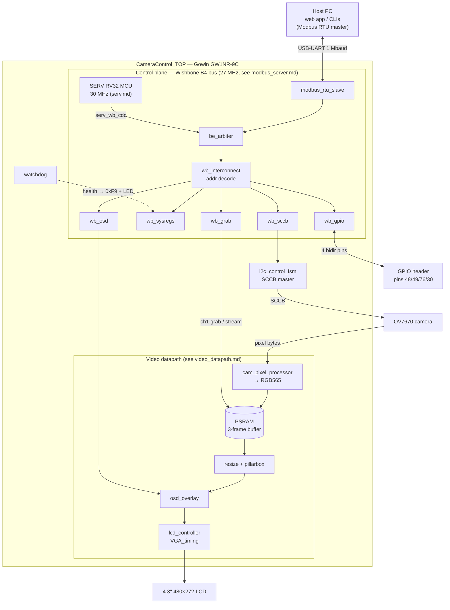
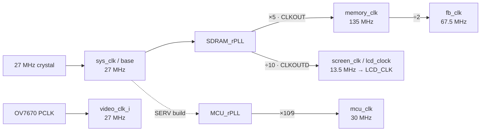
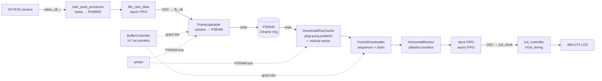
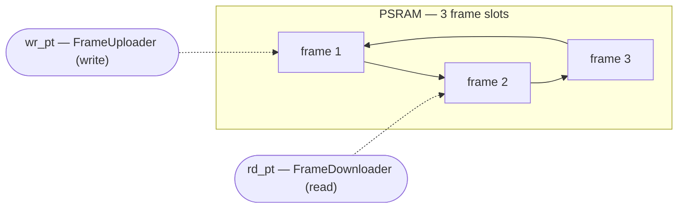
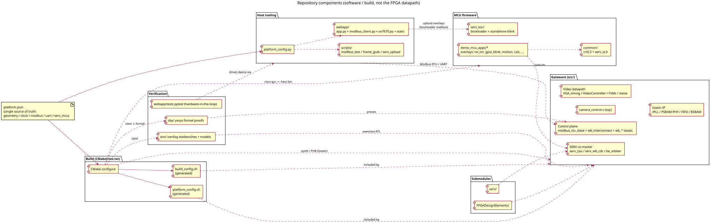

# Architecture

This document describes the FPGA design at a level of detail useful
when you need to change it. For a high-level pitch see the
[README](../README.md); for build / test / program mechanics see
[build.md](build.md).

## Solution components

The design is two cooperating subsystems inside `CameraControl_TOP` — a **video
datapath** (camera → PSRAM frame buffer → resize → LCD) and a **27 MHz control
plane** (a Wishbone bus reached by the host over Modbus *and* by an on-chip SERV
RISC-V core) — plus a health watchdog. External interfaces: the OV7670 camera, the
LCD panel, the host USB-UART, and 4 GPIO pins.



## Target and constraints

- **FPGA:** Gowin GW1NR-9C, part `GW1NR-LV9QN88PC6/I5` (Tang Nano 9K).
- **Top-level module:** `CameraControl_TOP` in
  [`src/camera_control.v`](../src/camera_control.v).
- **Physical constraints:** [`src/camera_ov7670.cst`](../src/camera_ov7670.cst).
- **Timing constraints:** [`src/camera_control.sdc`](../src/camera_control.sdc).

The top is plain `.v`; most of the newer state machines and
controllers are SystemVerilog 2012 (`iverilog -g2012`). New
synthesizable modules can be either, but should match the convention
of the file they sit in. Don't rewrite working `.v` modules as `.sv`
for cosmetic reasons.

## Clock plan

The 27 MHz crystal (`sys_clk`, the `.sdc` `base` clock) is the root. The memory
rPLL `SDRAM_rPLL` ([`src/gowin_rpll/memory_rpll.v`](../src/gowin_rpll/memory_rpll.v))
derives the PSRAM and LCD clocks from it; on a **SERV build** a second rPLL
`MCU_rPLL` ([`src/gowin_rpll/mcu_rpll.v`](../src/gowin_rpll/mcu_rpll.v)) adds the
soft-core clock:

| Clock                       | Frequency | Driven by                              | Used for                                       |
| --------------------------- | --------- | -------------------------------------- | ---------------------------------------------- |
| `sys_clk` (`base`)          | 27 MHz    | Crystal (port)                         | System logic, I2C, control-plane bus, OV7670 XCLK |
| `memory_clk`                | 135 MHz   | `SDRAM_rPLL` ×5 (CLKOUT)               | PSRAM HyperRAM PHY                             |
| `fb_clk`                    | 67.5 MHz  | `memory_clk` ÷ 2 (PSRAM IP `clkdiv`)   | Frame-buffer arbiter, FrameDownloader/Uploader |
| `screen_clk` (`lcd_clock`)  | 13.5 MHz  | `SDRAM_rPLL` ÷ 10 (CLKOUTD)            | LCD pixel clock (`LCD_CLK`) + OSD/screen domain |
| `video_clk_i` (`video_clock`)| 27 MHz   | Camera PCLK (input port)               | OV7670 capture side                            |
| `mcu_clk`                   | 30 MHz    | `MCU_rPLL` ×10⁄9 — **SERV build only**  | SERV RV32 soft core                            |



`memory_clock` and `base` are declared as **exclusive** clock groups in the `.sdc`;
the `lcd_clock`→`video_clock` and `video_clock`→`memory_clock` paths are marked
`false_path` since those buffer crossings rely on CDC primitives, not single-cycle
paths. On a SERV build `mcu_clk` is declared **asynchronous** to every other clock
group — `serv_wb_cdc` owns the crossing into `sys_clk`. (The `.sdc` models
`lcd_clock` as `base ÷ 2` — numerically the same 13.5 MHz — rather than as the PLL
CLKOUTD it physically is.)

Crossings between domains use the `CDC_*` and `Pulse_*` / `Pipeline_*`
primitives from the [`FPGADesignElements/`](../FPGADesignElements)
submodule. Re-use those rather than rolling new synchronizers.

## High-level data flow



Two FSMs sit on either side of PSRAM (the direction names are from the
*memory's* perspective — easy to flip mentally, so check the port list
before wiring anything):

- **`FrameUploader`** ([`src/fsms/FrameUploader.sv`](../src/fsms/FrameUploader.sv))
  drains the camera FIFO and **writes** 640×480 RGB565 pixels *into* a
  free frame slot (uploads pixels into memory).
- **`FrameDownloader`** ([`src/fsms/FrameDownloader.sv`](../src/fsms/FrameDownloader.sv))
  **reads** pixels back *out* of the active display frame (downloads
  pixels from memory) and feeds them to the LCD path. It is a thin
  sequencer + drain over **`DownloadRowCache`**
  ([`src/DownloadRowCache.sv`](../src/DownloadRowCache.sv)), a ping-pong
  row-prefetch cache that owns the PSRAM reads and the **vertical resize**;
  **`HorizontalResizer`** then adds the pillarbox borders downstream. See
  [state_machines.md](state_machines.md).

`FrameUploader`, `FrameDownloader`, `BufferController` and the
`arbiter` all live inside
[`src/video_controller.sv`](../src/video_controller.sv), which is in
turn wrapped by [`src/VGA_timing.v`](../src/VGA_timing.v) together with
the PSRAM IP, `cam_pixel_processor`, `lcd_controller`, and the channel-1
frame-grab engine. The module layout inside `VGA_timing`, the four-way
arbiter, the camera-write DMA, and the frame-download path are documented
in [video_datapath.md](video_datapath.md).

`BufferController` ([`src/BufferController.sv`](../src/BufferController.sv))
owns the write / read pointers and decides when each FSM is allowed
to advance to the next slot. The PSRAM bus is shared between them by
[`src/arbiter.v`](../src/arbiter.v).

For the per-state behaviour of the two FSMs (state diagrams, command-token
handshakes, the resize / pillarbox states), see
[state_machines.md](state_machines.md).

## Camera initialization (I2C / SCCB)

OV7670 register values come from a ROM
([`src/ov7670_default.sv`](../src/ov7670_default.sv) — the table is
defined via [`src/ov7670_regs.vh`](../src/ov7670_regs.vh)).

At power-on, `i2c_control_fsm` walks the ROM and pushes each
`(addr, value)` pair to the camera over SCCB through `i2c_master_top`
(the I2C stack in [`src/i2c/`](../src/i2c/)). Status LEDs reflect
completion / errors. After initialization the camera streams pixels
on its own clock domain (`video_clk_i`).

## Runtime register access over Modbus (Direct 1:1)

After the power-on load finishes, the same `i2c_control_fsm` is reused
to let a host read and write **live OV7670 registers** over the
FT2232H channel-B UART (1 Mbaud 8-E-1). A Modbus RTU slave
([`src/modbus/modbus_rtu_slave.sv`](../src/modbus/modbus_rtu_slave.sv), slave id 7)
runs with `EXTERNAL_BACKEND=1`: instead of an internal register file,
every holding-register access is handed to
[`src/modbus/modbus_cam_backend.sv`](../src/modbus/modbus_cam_backend.sv) over a small
request/ready handshake. That handshake is a **Wishbone B4 classic-standard**
master cycle, and `modbus_cam_backend` is a thin wrapper around a
`wb_interconnect` that address-decodes to five peripheral slaves
(`wb_sccb`, `wb_sysregs`, `wb_grab`, `wb_osd`, `wb_gpio`), all in the 27 MHz
`sys_clk` domain. A camera-register access routes to `wb_sccb`, which turns it into one
SCCB transaction. The mapping is **Direct 1:1** — the Modbus holding-register
address *is* the OV7670 register number (`0x00..0xC9`); a write uses the
low byte of the value, a read returns `{8'h00, reg_byte}`. See
[modbus_server.md](modbus_server.md) for the full bus and per-slave detail.

`camera_control.v` multiplexes the SCCB controller's command inputs by
ownership: the init FSM owns it until the ROM load reaches
`TRANSMIT_COMPLETE`, which latches `cam_init_complete`; from then on the
bridge owns it. The bridge stays idle until `cam_init_complete`, so the
default configuration is loaded undisturbed ("block until init done").
The bridge also answers reserved addresses directly (no SCCB): `0xF0`
firmware magic `0xA5`, `0xF1`/`0xF2` a free-running 16-bit uptime so a
host can detect a hard reset, `0xF3`/`0xF8` plus the stream band
`≥ 0x1000` that drive the frame grab (see below), and `0xFB`–`0xFD` that
write the [OSD text overlay](#osd-text-overlay) on the LCD.

The FC03 *response* payload lives in inferred BSRAM (`MAX_QTY = 127`), so
a single read can carry the protocol-max 127 registers — this is what
makes the frame download practical. The slave's `MAX_FRAME` (32) now only
bounds the *request* buffer (FC10 camera writes). The bridge runs
entirely on the 27 MHz `sys_clk` domain. End-to-end coverage:
`sim/integration/modbus/cam_bridge`.

The Modbus server's two blocks, their state machines, and all their
connections are documented in [modbus_server.md](modbus_server.md); the
full host-facing reference (register map, status registers, LEDs, web
app, CLI) is in [host_control.md](host_control.md).

### Frame grab and host download

The second PSRAM channel (channel 1) lets a host capture a full 640×480
frame and download it over the same Modbus link. `psram_ch1` *tees* the
channel-0 camera-write stream into channel 1 for one frame (armed by
register `0xF3`), then serves it back as 8-word burst reads;
`modbus_cam_backend` streams it pixel-by-pixel to FC03 reads of the
`≥ 0x1000` band. A full frame downloads in ~10 s at 1 Mbaud. The capture
costs no extra PSRAM read bandwidth and needs no arbiter changes — see
[video_datapath.md](video_datapath.md#frame-grab-and-host-download).

## MCU subsystem and peripherals

On a SERV build (`platform.json` `serv_mcu.enable`, default true) an on-chip
RISC-V soft core becomes a **second master** on the control-plane bus. This
section covers the core, how it reaches the bus, and the peripherals it and the
host share. (On a non-SERV build the core and its CDC are excluded; the host
remains the only master and the same peripherals are reachable over Modbus.)

### SERV RV32 soft core

The MCU is [olofk/serv](https://github.com/olofk/serv) — a **bit-serial RV32I**
core (no hardware multiply/divide, no FPU; floating point is libgcc soft-float),
so it is tiny (~0.5–1 MIPS) but fits comfortably alongside the video datapath.

- [`src/serv/serv_cpu.v`](../src/serv/serv_cpu.v) is SERV's `servant` SoC **minus
  its on-chip timer / GPIO / address mux** — the unified RAM stays, and the core's
  external Wishbone port (`o_wb_ext_*`) is routed out to the camera bus instead.
- Runs on its own **30 MHz `mcu_clk`** (`MCU_rPLL`), decoupled from the 27 MHz bus.
- **16 KB unified I/D RAM**: a 4 KB bootloader at `0x0000` plus up to 12 KB for the
  loaded overlay + stack at `0x1000` (the larger size lets soft-float overlays such
  as `demo_mcu_apps/calc` fit).
- Boots a bootloader that loads firmware **overlays from the host at runtime** (no
  reflash) through the `wb_sysregs` mailbox, then jumps to `0x1000`. A host write to
  `0xE2` (`MCU reset`) restarts the core back into the bootloader from any state.
- **No timer or interrupts.** This variant strips SERV's `MTIMER`, and `i_timer_irq`
  is tied to `1'b0`, so there is no periodic interrupt or cycle counter on the MCU.
  Code that needs a time base reads the free-running **uptime** counter (`0xF1/0xF2`,
  ~1 Hz) over the bus, or paces off frame cadence — the `motion` / `roi_tm` demos
  report FPS this way because their loop is grab-bound, not timer-driven.

See [serv.md](serv.md) for the bring-up, bootloader/overlay protocol, and the
firmware demos in [`demo_mcu_apps/`](../demo_mcu_apps/) (motion detection, a
soft-float calculator, GPIO blink, and `roi_tm`, an on-device Tsetlin-Machine
face-presence classifier).

### Reaching the bus (CDC + arbiter)

SERV drives a word-addressed Wishbone port on `mcu_clk`; two shims connect it to
the 27 MHz register backend:

- **`serv_wb_cdc`** ([`src/serv/serv_wb_cdc.v`](../src/serv/serv_wb_cdc.v)) crosses
  `mcu_clk` → `sys_clk` and maps SERV's word access (word address + byte-enables)
  onto the byte-addressed backend: `be_addr = word_addr + lane_offset(sel)`, with the
  data extracted/placed at that lane. This lets RV32I `lw`/`sw` reach any register,
  aligned or not (covered by `sim/unit/serv_wb_cdc`).
- **`be_arbiter`** ([`src/modbus/be_arbiter.v`](../src/modbus/be_arbiter.v))
  multiplexes the Modbus host (master 0) and SERV (master 1) onto the single
  `modbus_cam_backend` `be_*` port. The **host has priority**; whichever master is
  granted is **owner-locked until the transaction completes** (no mid-transaction
  preemption), so the two never corrupt each other.

The MCU addresses peripherals through an **EXT window at `0x40000000`** — the low 16
bits are the register number, so `*(volatile uint16_t *)(0x40000000 + 0xE0)` is the
same heartbeat register the host reads at Modbus address `0xE0`. The C accessors are
in [`demo_mcu_apps/common/serv_io.h`](../demo_mcu_apps/common/serv_io.h).

### Peripherals (shared `wb_*` slaves)

Both masters see the identical five-slave map decoded by
[`wb_interconnect`](../src/modbus/wb_interconnect.sv) (per-address equality, not
ranges, so `wb_grab`'s `0xF3–F8` isn't swallowed by a naïve `0xF0–FA` range):

| Slave | Address(es) | Function |
| ----- | ----------- | -------- |
| [`wb_sccb`](../src/modbus/wb_sccb.sv) | `0x00`–`0xC9` | OV7670 camera registers, one SCCB transaction each (Direct 1:1). |
| [`wb_sysregs`](../src/modbus/wb_sysregs.sv) | `0xE0,E2,E4,E8,EC,F0,F1,F2,F9,FA` | Status + control: `0xF0` magic `0xA5`, `0xF1/F2` uptime, `0xF9` watchdog health, `0xFA` re-run camera init, `0xE0` co-master heartbeat scratch, `0xE2` MCU reset, `0xE4/E8/EC` bootloader mailbox (len / data / status). |
| [`wb_grab`](../src/modbus/wb_grab.sv) | `0xF3`–`0xF8`, read band `≥ 0x1000` | Frame-grab arm + channel-1 PSRAM burst write/read + the pixel stream the host downloads. |
| [`wb_osd`](../src/modbus/wb_osd.sv) | `0xFB,FC,FD` | OSD text overlay: control (enable/clear), cursor, character (auto-increment). |
| [`wb_gpio`](../src/modbus/wb_gpio.sv) | `0xEA,EB` | 4 bidirectional GPIO pins (below). |

The watchdog health word (`0xF9`) and the uptime counter (`0xF1/F2`,
`UPTIME_DIV ≈ sys_clk` for a ~1 Hz tick) are produced in the bridge itself; an
access to one slave's address never disturbs another's (every side-effect is
qualified by `stb & cyc`).

### GPIO (`wb_gpio`)

[`wb_gpio`](../src/modbus/wb_gpio.sv) exposes **4 bidirectional pins** — Tang Nano
9K pins **48 / 49 / 76 / 30** = `gpio[3:0]` — to both masters:

- `0xEA` **`GPIO_DIR`** — bits `[3:0]`, `1` = output (drive), `0` = input. Resets to
  `0`, so every pin is a **hi-Z input** at power-on.
- `0xEB` **`GPIO_DATA`** — a write sets the value driven on output pins; a read
  returns the **live pin levels**, passed through a 2-FF synchroniser first.

The pins are tri-stated in `camera_control.v` (`gpio[i] = gpio_dir[i] ? gpio_out[i]
: 1'bz`). Either master can own them: `demo_mcu_apps/gpio_blink` walks a pattern
from the MCU while the host watches over Modbus, and the host can equally drive them
itself (`modbus_client.gpio_*`). Coverage: `sim/unit/wb_gpio` + a `FORMAL` block.

## Capture path

The OV7670 produces two pixel-clocks per RGB565 pixel (high byte then
low byte). [`src/cam_pixel_processor.sv`](../src/cam_pixel_processor.sv)
packs the byte stream into 16-bit pixels and pushes them into the
camera-side FIFO (`fifo_cam_data`, a Gowin async FIFO instance from
[`src/fifo_top/`](../src/fifo_top)).

`FrameUploader` (running on `fb_clk`) drains the FIFO in bursts,
forms PSRAM write commands, and hands them to the arbiter. When it
finishes the last row of a frame it asks `BufferController` to
advance the write pointer.

## 3-frame circular buffer

The buffer organizes the PSRAM as three frame slots and runs two
pointers around them, mirroring Gowin's Video Frame Buffer IP
behavior:



- `rd_pt` cycles frame1 → frame2 → frame3 → frame1 …
- `wr_pt` does the same, independently.
- **Writer faster than reader** → writer skips its current target
  forward, overwriting the previous frame (drops a frame to keep up).
- **Reader faster than writer** → reader stays on its current frame
  and replays it until the writer advances (repeats a frame).

This decouples the camera and LCD rates without needing them to match
or be PLL-locked.

## Display path

`FrameDownloader` reads pixels out of the active display frame and
pushes them into an asynchronous FIFO toward the LCD domain.
[`src/video_controller.sv`](../src/video_controller.sv) pulls pixels
from that FIFO and drives [`src/lcd_controller.sv`](../src/lcd_controller.sv),
which uses [`src/VGA_timing.v`](../src/VGA_timing.v) to generate
HSYNC / VSYNC / DE for the 4.3" 480×272 panel.

The 640×480 → LCD-size resize happens on the read side in two places:
[`src/resize/PositionScaler_vert.sv`](../src/resize/PositionScaler_vert.sv) drives the
**vertical** downscale (480 → 272) from inside `DownloadRowCache` (it sets
the per-row source-address stride), and
[`src/resize/PositionScaler_horz.sv`](../src/resize/PositionScaler_horz.sv) drives the
**horizontal** downscale inside `HorizontalResizer`, which also adds the
pillarbox borders. Both are compact DDA kernels (the older LUT variant is
generated by [`scripts/scaler_generator.py`](../scripts/scaler_generator.py)).
The number of source columns `FrameDownloader` reads/emits per row — and that
`HorizontalResizer` downscales — is the `EMIT_ROW_SIZE` parameter (640 for the
full row). See [state_machines.md](state_machines.md) for the FSMs.

### OSD text overlay

[`src/osd_overlay.sv`](../src/osd_overlay.sv) sits between `lcd_controller` and
the LCD pins and paints a white **8×16 font** text layer (60×17 character grid)
over the live video. The host fills the character buffer over Modbus
(`0xFB`–`0xFD`); the buffer is a dual-clock RAM crossing `sys_clk`→`screen_clk`
and the enable bit crosses through a `CDC_Bit_Synchronizer`. It is transparent
when disabled. Details in [video_datapath.md](video_datapath.md#osd-text-overlay).

### Configuration

Frame geometry is defined once in [`platform.json`](../platform.json)
(input/screen size, `emit_row_size`); CMake generates the SystemVerilog header
`src/platform_config.vh` from it, which `VGA_timing.v` includes and feeds to
`VideoController`. The geometry parameters (`FRAME_WIDTH`/`FRAME_HEIGHT`,
`ORIG_FRAME_WIDTH`/`HEIGHT`, `EMIT_ROW_SIZE`) have no defaults, so they must be
supplied explicitly. See [build.md](build.md#platform-configuration).

## Debug / bring-up paths

Two synthetic pattern generators bypass the camera input entirely:

- [`src/debug/debug_pattern_generator.sv`](../src/debug/debug_pattern_generator.sv)
- [`src/debug/debug_pattern_generator2.sv`](../src/debug/debug_pattern_generator2.sv)

These are wired into several testbenches (`debug_pattern_generator/*`,
`buffer_controller/*`) and are useful when you need a known,
predictable input to chase an integration bug without the camera in
the loop.

### Health watchdog

[`src/watchdog.sv`](../src/watchdog.sv) (instantiated in `VGA_timing`, runs on
`sys_clk`) monitors an activity heartbeat from each of three subsystems — LCD
rendering (`LCD_VSYNC`), the memory subsystem (`rd_data_valid` / `cmd_en`), and
OV7670 capture (`cam_vsync`). The three are on unrelated clock domains, so each
is brought in through a `CDC_Bit_Synchronizer` and edge-detected; after a ~2 s
startup grace, a subsystem with no activity for ~0.5 s latches a sticky hang.

It surfaces the result two ways: the **debug LED** (pin 13) blinks ~1.6 Hz when
healthy and goes solid-on on any hang, and a packed status word is exported to
the Modbus bridge as read-only register **`0xF9`** (per-subsystem + `any_hang` +
`monitoring` bits). Unit test: `watchdog/health`. Host-facing detail and the bit
layout are in [host_control.md](host_control.md#board-health-watchdog).

## Pin map

The `cst` file is the authoritative source; this is just the
shape of the connections.

### LCD (480×272 RGB565, 16 bpp + DE/HSYNC/VSYNC)

| Signal       | Pins                | Notes              |
| ------------ | ------------------- | ------------------ |
| `LCD_R[4:0]` | 71 72 73 74 75      |                    |
| `LCD_G[5:0]` | 55 56 57 68 69 70   |                    |
| `LCD_B[4:0]` | 41 42 51 53 54      |                    |
| `LCD_CLK`    | 35                  |                    |
| `LCD_DEN`    | 33                  |                    |
| `LCD_SYNC`   | 34                  | VSYNC              |
| `LCD_HYNC`   | 40                  | HSYNC (repo spelling) |

### OV7670

| Signal            | Pins                    | Notes                  |
| ----------------- | ----------------------- | ---------------------- |
| `cam_data_i[7:0]` | 79 77 81 80 83 82 85 84 |                        |
| `v_sync_i`        | 31                      | VSYNC from camera      |
| `h_sync_i`        | 32                      | HREF from camera       |
| `video_clk_i`     | 28                      | PCLK from camera       |
| `cam_clk`         | 29                      | XCLK to camera (= sys_clk) |
| `cam_reset`       | 63                      |                        |
| `cam_pwdn`        | 27                      | held low — always powered |
| `master_sda`      | 25                      | SCCB data              |
| `master_scl`      | 26                      | SCCB clock             |

### Board

| Signal        | Pins      | Notes              |
| ------------- | --------- | ------------------ |
| `sys_clk`     | 52        | 27 MHz crystal     |
| `sys_rst_n`   | 4         | S2 button          |
| `status_leds` | 14 15 16  |                    |
| `debug_led`   | 13        |                    |
| `led_out`     | 10        |                    |
| `led_out1`    | 11        |                    |
| `gpio[3:0]`   | 48 49 76 30 | `wb_gpio` bidirectional GPIO (regs 0xEA/0xEB) |

PSRAM (`O_psram_*` / `IO_psram_*`) is routed to the GW1NR-9C's
on-package HyperRAM through the Gowin
`psram_memory_interface_hs_2ch` IP — its pin assignments come from
the IP, not the user `.cst`. Channel 0 is the live video frame buffer;
**channel 1** is owned by `src/psram_ch1.sv`, which on request *tees* the camera
write stream into ch1 to capture a full frame and serves it back as 8-word burst
reads. `modbus_cam_backend.sv` streams that frame to the host over Modbus FC03
(stream band `≥ 0x1000`) — see [host_control.md](host_control.md#frame-grab-and-download).

## Repository components

How the repo's parts fit together as software/build components (the FPGA datapath
itself is in [Solution components](#solution-components) above). `platform.json` is
the single source of truth both the gateware and the host read; CMake is the
orchestrator that generates the config headers, builds the gateware + MCU firmware,
and drives the test suites.



> Rendered from [`diagrams/repo_components.puml`](diagrams/repo_components.puml) (PlantUML) — edit the `.puml` and re-render to update `images/repo_components.svg`.

## Source-tree organization

```
src/                  Synthesizable RTL
├── fsms/             FrameDownloader, FrameUploader state machines
├── gowin_rpll/       PLL IP (regenerate from IDE — don't hand-edit)
├── gowin_sdpb/       Dual-port BRAM IP
├── gowin_sdpb_dn/    Dual-port BRAM IP (legacy download cache — no longer instantiated)
├── gowin_alu54/      DSP block IP for the scaler
├── fifo_top/         Async FIFO IP (camera-side)
├── psram_memory_interface_hs_2ch/   HyperRAM PHY IP
├── sdpb_1kx32/       1Kx32 BRAM IP (camera row buffers + download prefetch banks)
├── cam_settings_rom/ ROM IP holding OV7670 register defaults
├── i2c_master/       I2C / SCCB master core
└── (top-level: camera_control.v, BufferController.sv, video_controller.sv,
   lcd_controller.sv, VGA_timing.v, osd_overlay.sv, font8x16_init.vh,
   cam_pixel_processor.sv, DownloadRowCache.sv, HorizontalResizer.sv,
   PositionScaler_horz.sv, PositionScaler_vert.sv,
   ov7670_default.sv, ov7670_regs.vh, debug_pattern_generator{,2}.sv,
   uart.sv, modbus_rtu_slave.sv, modbus_cam_backend.sv,
   wb_interconnect.sv, wb_sccb.sv, wb_sysregs.sv, wb_grab.sv, wb_osd.sv, wb_gpio.sv,
   serv/ (SERV RV32 co-master: serv_cpu.v, serv_wb_cdc.v, be_arbiter.v),
   camera_ov7670.cst, camera_control.sdc, …)

sim/                  Icarus Verilog testbenches and behavioural models
├── common/           Shared infra + models (psram_model.sv, i2c_slave_model.sv,
│                     svlogger.sv, test_utils.sv, …)
├── unit/             Per-module tests (unit/<dut>/<scenario>.sv)
└── integration/      Cross-module tests (integration/<topic>/<scenario>.sv)

FPGADesignElements/   Submodule — CDC and pipeline primitives
scripts/              Codegen helpers (e.g. scaler_generator.py)
physical/             OpenSCAD + STL for the 3D-printed enclosure
doc/                  Diagrams, photos, this guide
```

The Gowin IP cores (every `gowin_*`, `fifo_top`, `psram_memory_interface_hs_2ch`,
`sdpb_1kx32`, `cam_settings_rom`) are generated by Gowin IDE.
Regenerate them through the IDE rather than hand-editing the `.v` /
`.vo` outputs.

When adding a new top-level synthesizable module, register it in
**both**:

1. `camera_ov7670.gprj` (so the Gowin IDE picks it up for synthesis).
2. The relevant CMake source list — `VIDEO_BUFFER_TEST_SOURCES` in
   [`sim/CMakeLists.txt`](../sim/CMakeLists.txt) for simulation, or
   `SYNT_SOURCES` in [`src/CMakeLists.txt`](../src/CMakeLists.txt) if
   it belongs to the standalone synthesis target.
