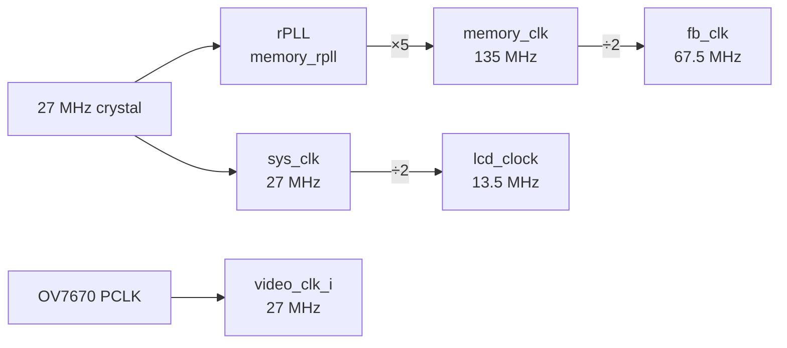
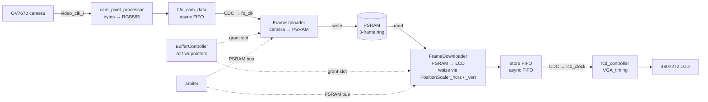

# Architecture

This document describes the FPGA design at a level of detail useful
when you need to change it. For a high-level pitch see the
[README](../README.md); for build / test / program mechanics see
[build.md](build.md).

## Target and constraints

- **FPGA:** Gowin GW1NR-9C, part `GW1NR-LV9QN88PC6/I5` (Tang Nano 9K).
- **Top-level module:** `CameraControl_TOP` in
  [`src/camera_control.v`](../src/camera_control.v).
- **Physical constraints:** [`src/camera_ov7670.cst`](../src/camera_ov7670.cst).
- **Timing constraints:** [`src/camera_control.sdc`](../src/camera_control.sdc).

The top is plain `.v`; most of the newer state machines and
controllers are SystemVerilog 2012 (`iverilog -g2012`). New
synthesizable modules can be either, but should match the convention
of the file they sit in. Don't rewrite working `.v` modules as `.sv`
for cosmetic reasons.

## Clock plan

A single Gowin rPLL ([`src/gowin_rpll/memory_rpll.v`](../src/gowin_rpll/memory_rpll.v))
fans the 27 MHz crystal out into the four clocks the design needs:

| Clock           | Frequency | Driven by         | Used for                                      |
| --------------- | --------- | ----------------- | --------------------------------------------- |
| `sys_clk`       | 27 MHz    | Crystal           | System logic, I2C, OV7670 XCLK                |
| `memory_clk`    | 135 MHz   | rPLL ×5           | PSRAM HyperRAM PHY                            |
| `fb_clk`        | 67.5 MHz  | `memory_clk` ÷ 2  | Frame buffer arbiter, FrameDownloader/Uploader|
| `lcd_clock`     | 13.5 MHz  | `sys_clk` ÷ 2     | LCD pixel clock                               |
| `video_clk_i`   | 27 MHz    | Camera PCLK input | OV7670 capture side                           |



`memory_clk` and `sys_clk` are declared as **exclusive** clock groups
in the `.sdc`; `lcd_clock`→`video_clock` and
`video_clock`→`memory_clock` paths are marked `false_path` since
buffer crossings rely on CDC primitives, not single-cycle paths.

Crossings between domains use the `CDC_*` and `Pulse_*` / `Pipeline_*`
primitives from the [`FPGADesignElements/`](../FPGADesignElements)
submodule. Re-use those rather than rolling new synchronizers.

## High-level data flow



Two FSMs sit on either side of PSRAM (the direction names are from the
*memory's* perspective — easy to flip mentally, so check the port list
before wiring anything):

- **`FrameUploader`** ([`src/fsms/FrameUploader.sv`](../src/fsms/FrameUploader.sv))
  drains the camera FIFO and **writes** 640×480 RGB565 pixels *into* a
  free frame slot (uploads pixels into memory).
- **`FrameDownloader`** ([`src/fsms/FrameDownloader.sv`](../src/fsms/FrameDownloader.sv))
  **reads** pixels back *out* of the active display frame (downloads
  pixels from memory) and feeds them to the LCD path, applying the
  resize.

`FrameUploader`, `FrameDownloader`, `BufferController` and the
`arbiter` all live inside
[`src/video_controller.sv`](../src/video_controller.sv), which is in
turn wrapped by [`src/VGA_timing.v`](../src/VGA_timing.v) together with
the PSRAM IP, `cam_pixel_processor` and `lcd_controller`.

`BufferController` ([`src/BufferController.sv`](../src/BufferController.sv))
owns the write / read pointers and decides when each FSM is allowed
to advance to the next slot. The PSRAM bus is shared between them by
[`src/arbiter.v`](../src/arbiter.v).

For the per-state behaviour of the two FSMs (state diagrams, command-token
handshakes, the resize / pillarbox states), see
[state_machines.md](state_machines.md).

## Camera initialization (I2C / SCCB)

OV7670 register values come from a ROM
([`src/ov7670_default.sv`](../src/ov7670_default.sv) — the table is
defined via [`src/ov7670_regs.vh`](../src/ov7670_regs.vh)).

At power-on, `i2c_control_fsm` walks the ROM and pushes each
`(addr, value)` pair to the camera over SCCB through `i2c_master`
([`src/i2c_master/`](../src/i2c_master/)). Status LEDs reflect
completion / errors. After initialization the camera streams pixels
on its own clock domain (`video_clk_i`).

## Capture path

The OV7670 produces two pixel-clocks per RGB565 pixel (high byte then
low byte). [`src/cam_pixel_processor.sv`](../src/cam_pixel_processor.sv)
packs the byte stream into 16-bit pixels and pushes them into the
camera-side FIFO (`fifo_cam_data`, a Gowin async FIFO instance from
[`src/fifo_top/`](../src/fifo_top)).

`FrameUploader` (running on `fb_clk`) drains the FIFO in bursts,
forms PSRAM write commands, and hands them to the arbiter. When it
finishes the last row of a frame it asks `BufferController` to
advance the write pointer.

## 3-frame circular buffer

The buffer organizes the PSRAM as three frame slots and runs two
pointers around them, mirroring Gowin's Video Frame Buffer IP
behavior:


- `rd_pt` cycles frame1 → frame2 → frame3 → frame1 …
- `wr_pt` does the same, independently.
- **Writer faster than reader** → writer skips its current target
  forward, overwriting the previous frame (drops a frame to keep up).
- **Reader faster than writer** → reader stays on its current frame
  and replays it until the writer advances (repeats a frame).

This decouples the camera and LCD rates without needing them to match
or be PLL-locked.

## Display path

`FrameDownloader` reads pixels out of the active display frame and
pushes them into an asynchronous FIFO toward the LCD domain.
[`src/video_controller.sv`](../src/video_controller.sv) pulls pixels
from that FIFO and drives [`src/lcd_controller.sv`](../src/lcd_controller.sv),
which uses [`src/VGA_timing.v`](../src/VGA_timing.v) to generate
HSYNC / VSYNC / DE for the 4.3" 480×272 panel.

[`src/PositionScaler_horz.sv`](../src/PositionScaler_horz.sv) and
[`src/PositionScaler_vert.sv`](../src/PositionScaler_vert.sv) handle
the 640×480 → LCD-size resize on the read side. Their lookup tables
are generated by
[`scripts/scaler_generator.py`](../scripts/scaler_generator.py).
The current baseline only has vertical scaling working — see
[Known issues](../README.md#known-issues).

## Debug / bring-up paths

Two synthetic pattern generators bypass the camera input entirely:

- [`src/debug_pattern_generator.sv`](../src/debug_pattern_generator.sv)
- [`src/debug_pattern_generator2.sv`](../src/debug_pattern_generator2.sv)

These are wired into several testbenches (`debug_pattern_generator/*`,
`buffer_controller/*`) and are useful when you need a known,
predictable input to chase an integration bug without the camera in
the loop.

## Pin map

The `cst` file is the authoritative source; this is just the
shape of the connections.

### LCD (480×272 RGB565, 16 bpp + DE/HSYNC/VSYNC)

| Signal       | Pins                | Notes              |
| ------------ | ------------------- | ------------------ |
| `LCD_R[4:0]` | 71 72 73 74 75      |                    |
| `LCD_G[5:0]` | 55 56 57 68 69 70   |                    |
| `LCD_B[4:0]` | 41 42 51 53 54      |                    |
| `LCD_CLK`    | 35                  |                    |
| `LCD_DEN`    | 33                  |                    |
| `LCD_SYNC`   | 34                  | VSYNC              |
| `LCD_HYNC`   | 40                  | HSYNC (repo spelling) |

### OV7670

| Signal            | Pins                    | Notes                  |
| ----------------- | ----------------------- | ---------------------- |
| `cam_data_i[7:0]` | 79 77 81 80 83 82 85 84 |                        |
| `v_sync_i`        | 31                      | VSYNC from camera      |
| `h_sync_i`        | 32                      | HREF from camera       |
| `video_clk_i`     | 28                      | PCLK from camera       |
| `cam_clk`         | 29                      | XCLK to camera (= sys_clk) |
| `cam_reset`       | 63                      |                        |
| `cam_pwdn`        | 27                      | held low — always powered |
| `master_sda`      | 25                      | SCCB data              |
| `master_scl`      | 26                      | SCCB clock             |

### Board

| Signal        | Pins      | Notes              |
| ------------- | --------- | ------------------ |
| `sys_clk`     | 52        | 27 MHz crystal     |
| `sys_rst_n`   | 4         | S2 button          |
| `status_leds` | 14 15 16  |                    |
| `debug_led`   | 13        |                    |
| `led_out`     | 10        |                    |
| `led_out1`    | 11        |                    |

PSRAM (`O_psram_*` / `IO_psram_*`) is routed to the GW1NR-9C's
on-package HyperRAM through the Gowin
`psram_memory_interface_hs_2ch` IP — its pin assignments come from
the IP, not the user `.cst`.

## Source-tree organization

```
src/                  Synthesizable RTL
├── fsms/             FrameDownloader, FrameUploader state machines
├── gowin_rpll/       PLL IP (regenerate from IDE — don't hand-edit)
├── gowin_sdpb/       Dual-port BRAM IP
├── gowin_sdpb_dn/    Dual-port BRAM IP (downsample variant)
├── gowin_alu54/      DSP block IP for the scaler
├── fifo_top/         Async FIFO IP (camera-side)
├── psram_memory_interface_hs_2ch/   HyperRAM PHY IP
├── sdpb_1kx32/       1Kx32 BRAM IP
├── cam_settings_rom/ ROM IP holding OV7670 register defaults
├── i2c_master/       I2C / SCCB master core
└── (top-level: camera_control.v, BufferController.sv, video_controller.sv,
   lcd_controller.sv, VGA_timing.v, cam_pixel_processor.sv,
   PositionScaler_horz.sv, PositionScaler_vert.sv,
   ov7670_default.sv, ov7670_regs.vh, debug_pattern_generator{,2}.sv,
   camera_ov7670.cst, camera_control.sdc, …)

sim/                  Icarus Verilog testbenches and behavioural models
├── common/           Shared infra + models (psram_model.sv, i2c_slave_model.sv,
│                     svlogger.sv, test_utils.sv, …)
├── unit/             Per-module tests (unit/<dut>/<scenario>.sv)
└── integration/      Cross-module tests (integration/<topic>/<scenario>.sv)

FPGADesignElements/   Submodule — CDC and pipeline primitives
scripts/              Codegen helpers (e.g. scaler_generator.py)
physical/             OpenSCAD + STL for the 3D-printed enclosure
doc/                  Diagrams, photos, this guide
```

The Gowin IP cores (every `gowin_*`, `fifo_top`, `psram_memory_interface_hs_2ch`,
`sdpb_1kx32`, `cam_settings_rom`) are generated by Gowin IDE.
Regenerate them through the IDE rather than hand-editing the `.v` /
`.vo` outputs.

When adding a new top-level synthesizable module, register it in
**both**:

1. `camera_ov7670.gprj` (so the Gowin IDE picks it up for synthesis).
2. The relevant CMake source list — `VIDEO_BUFFER_TEST_SOURCES` in
   [`sim/CMakeLists.txt`](../sim/CMakeLists.txt) for simulation, or
   `SYNT_SOURCES` in [`src/CMakeLists.txt`](../src/CMakeLists.txt) if
   it belongs to the standalone synthesis target.
