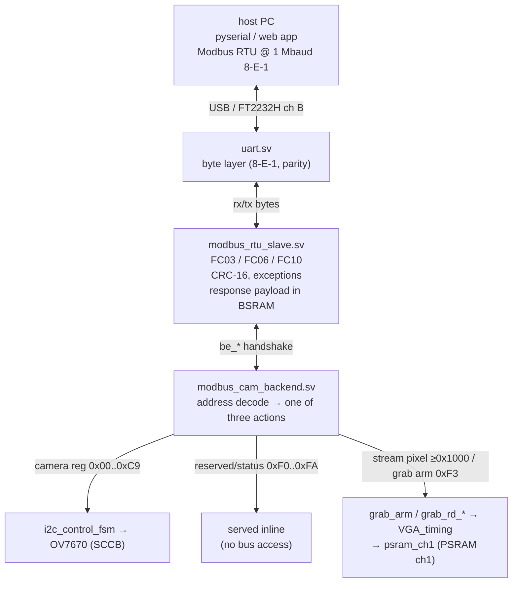
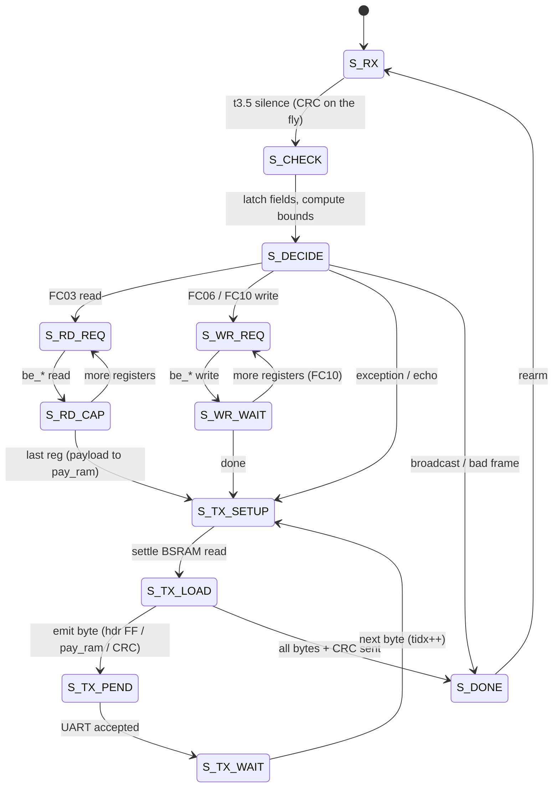
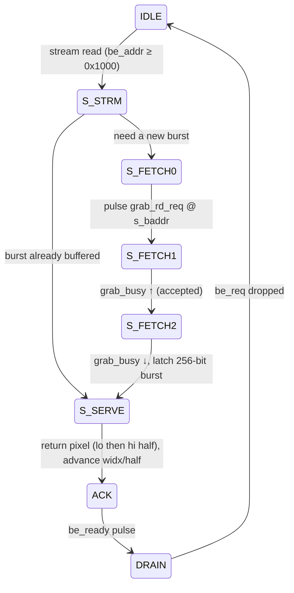

# Modbus server architecture

The board runs a **Modbus RTU slave** on the FT2232H channel-B UART so a host PC
can read/write live OV7670 registers, poll status, and grab full camera frames.
This document covers the two RTL blocks that implement it — `modbus_rtu_slave.sv`
(the protocol engine) and `modbus_cam_backend.sv` (the bridge that turns each
register access into a real action) — their state machines, and how they connect
to the rest of the design.

For the host-facing register map and usage, see
[host_control.md](host_control.md). For the channel-1 capture/stream hardware
the backend drives, see [video_datapath.md](video_datapath.md).

## Block diagram

Everything here runs in the **27 MHz `sys_clk`** domain. Only `psram_ch1`
crosses into the PSRAM `fb_clk` domain (handled internally by toggle CDCs).



The init FSM inside `camera_control.v` owns the SCCB controller during power-on
register load; once it reaches `TRANSMIT_COMPLETE` it latches
`cam_init_complete`, which (a) hands the `i2c_control_fsm` inputs over to the
backend via an ownership mux, and (b) lets the backend service camera-register
accesses. Reserved/status and stream accesses are served regardless of init
state.

## `modbus_rtu_slave.sv` — the protocol engine

Sits directly on `uart.sv`. Implements Modbus-over-serial RTU for a block of
16-bit holding registers:

| FC     | Function                | Notes                                        |
| ------ | ----------------------- | -------------------------------------------- |
| `0x03` | Read Holding Registers  | up to `MAX_QTY` (127) registers per request  |
| `0x06` | Write Single Register   | low byte reaches the camera                  |
| `0x10` | Write Multiple Registers| request bounded by `MAX_FRAME` (32)          |

Framing is by the **t3.5 silent interval** (a frame ends after ≥3.5 character
times of RX idle). CRC-16/Modbus (poly `0xA001`, init `0xFFFF`, LSB-first) is
checked on RX (a good frame CRCs to 0) and appended on TX. Bad CRC, wrong
address, parity error, or overflow → the frame is silently dropped. Address 0 is
broadcast (writes applied, no reply). Exceptions: `0x01` illegal function,
`0x02` illegal data address, `0x03` illegal data value.

### Pluggable register backend (`be_*`)

The protocol FSM never touches register storage directly — it issues a generic
**backend handshake** and stalls for `be_ready`:

```
be_req, be_we, be_addr, be_wdata   →   (backend)   →   be_ready, be_rdata
```

- `EXTERNAL_BACKEND = 0` (default): a tiny internal single-cycle RAM backend
  (used by the unit test) — `be_ready` the next cycle.
- `EXTERNAL_BACKEND = 1` (the real design): `modbus_cam_backend` answers, taking
  as long as it needs (an SCCB cycle, or a PSRAM burst). The FSM simply waits.

### State machine



**Two-stage decode (S_CHECK → S_DECIDE).** All the heavy arithmetic — the 16-bit
address+quantity adds, the `> REG_COUNT` / `> MAX_QTY` bounds compares, the
validity OR — lands in registers in `S_CHECK`. `S_DECIDE` is then only a shallow
mux on those flags into the response and next state. This keeps the path into
`state` short at 27 MHz.

**Response storage split (the BSRAM trick).** A full FC03 response can be up to
the protocol max of 127 registers (254 payload bytes). Holding that in
flip-flops would cost thousands of FFs, so:

- the **header / echo** (≤6 bytes: dev, func, byte-count, or the FC06/FC10 echo,
  or an exception) lives in `resp_hdr[0:5]` flip-flops;
- the **FC03 data payload** lives in `pay_ram`, a 16-bit-wide inferred **BSRAM**
  (`MAX_QTY` deep) written one register per `S_RD_CAP` iteration and read back
  synchronously during TX.

Because the BSRAM read is registered (one-cycle latency), `S_TX_SETUP` inserts a
settle cycle before each `S_TX_LOAD` so `pay_rdata` matches the current byte
index. `S_TX_LOAD` sources each TX byte from the header FFs for `tidx < hdr_len`,
from `pay_ram` (hi byte at even offset, lo at odd) for the payload, then the two
CRC bytes.

This is what lets one FC03 carry 127 pixels of a frame download while the design
stays well under the fabric budget (the payload maps to one block RAM; see
[video_datapath.md](video_datapath.md) for why a big burst matters).

## `modbus_cam_backend.sv` — the action bridge

Each `be_*` access is decoded by address into exactly one of three actions.

### 1. Camera register (`be_addr ≤ 0x00C9`) → live SCCB

Drives the existing `i2c_control_fsm` exactly the way the power-on init FSM does
(`store_data` held across the two stores for a write; a single store for a read):

- **Write** (`be_we=1`): `W_STORE_ADDR → W_STORE_VAL → W_STORE_DONE → W_SEND →
  W_SEND_CLR → W_WAIT_RDY` — store the register index then the value, pulse
  `send_data`, wait for `device_rdy`, ack.
- **Read** (`be_we=0`): `R_STORE_ADDR → R_STORE_DONE → R_STORE_WAIT → R_RECV →
  R_RECV_CLR → R_WAIT_VALID` — store the index, pulse `recv_data`, wait
  `data_valid`, return `{8'h00, data_out}`.

Camera accesses are **gated by `cam_init_complete`** — they wait in `IDLE` until
power-on init has released the SCCB bus.

### 2. Reserved / status register (`0xF0..0xFA`) → served inline

Answered directly in `IDLE` (no SCCB, no bus access), so the host can poll them
even during camera init:

| Addr        | Action                                                          |
| ----------- | --------------------------------------------------------------- |
| `0xF0`      | read firmware magic `0xA5`                                       |
| `0xF1/0xF2` | read uptime hi/lo (latched on the hi read for a coherent pair)   |
| `0xF3`      | write 1 = arm a grab; write 2 = single-word ch1 read; read = `{calib,busy}` |
| `0xF4/0xF5` | write the single-read ch1 address lo/hi (debug)                 |
| `0xF6/0xF7` | read the single-read ch1 word hi/lo halves (debug)              |
| `0xF8`      | write = rewind the download stream pointer to pixel 0           |
| `0xF9`      | read = watchdog board health `{monitoring, any_hang, cam, mem, lcd}` (from `wd_health`, see [video_datapath.md](video_datapath.md#health-watchdog)) |
| `0xFA`      | write 1 = reset to defaults — pulse `cam_reinit`, restarting the camera init FSM in `camera_control.v` (re-walks the ROM like power-on) |

### 3. Stream pixel (`be_addr ≥ 0x1000`) → frame download

This is the [frame download](video_datapath.md#frame-grab-and-host-download)
fast path. The backend keeps a stream pointer and a 256-bit burst buffer:



At the end of an 8-word burst the pointer advances (`s_baddr += 16`) and the
buffer is marked empty, so the next pixel triggers a fresh `S_FETCH0`.

Each `psram_ch1` read returns a full **8-word (16-pixel) burst**, so the backend
only hits PSRAM once per 16 pixels and serves the rest from `s_burst`. An FC03 of
125 registers therefore walks 125 consecutive frame pixels with at most ~8 ch1
reads; the host issues back-to-back FC03s from `0x1000` to pull the whole frame.

### Handshake tail

All three paths converge on `ACK` (assert `be_ready`, present `be_rdata`) then
`DRAIN` (wait for `be_req` to drop) before returning to `IDLE`, matching what the
slave's `S_RD_CAP` / `S_WR_WAIT` expect.

## Connections summary

| Signal group                                            | Between                                  |
| ------------------------------------------------------- | ---------------------------------------- |
| `tx_*` / `rx_*`                                         | `uart.sv` ↔ `modbus_rtu_slave`           |
| `be_req/we/addr/wdata` → `be_ready/rdata`               | `modbus_rtu_slave` ↔ `modbus_cam_backend`|
| `store_data/send_data/recv_data/i2c_din` → `device_rdy/data_valid/i2c_dout` | `modbus_cam_backend` ↔ `i2c_control_fsm` (muxed with the init FSM by `cam_init_complete`) |
| `grab_arm/grab_rd_req/grab_rd_addr` → `grab_busy/grab_rd_data[255:0]/grab_calib` | `modbus_cam_backend` ↔ `VGA_timing` → `psram_ch1` |

All of the above are on `sys_clk`. The grab signals cross into the PSRAM
`fb_clk` domain inside `psram_ch1` via toggle handshakes (req toggle + 2–3-FF
sync + edge detect), so the backend never sees the crossing.
