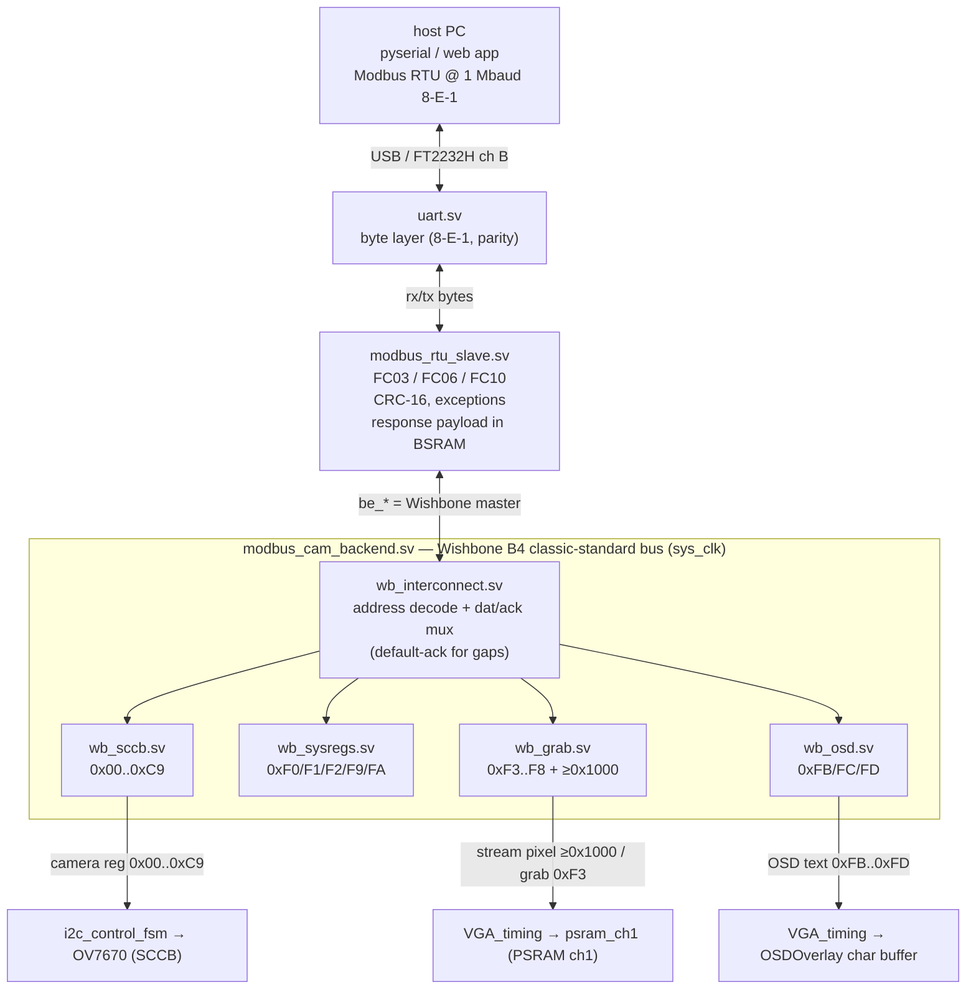
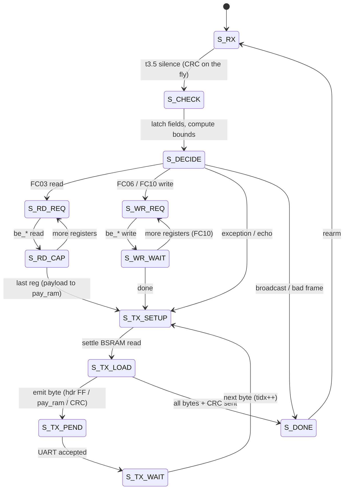
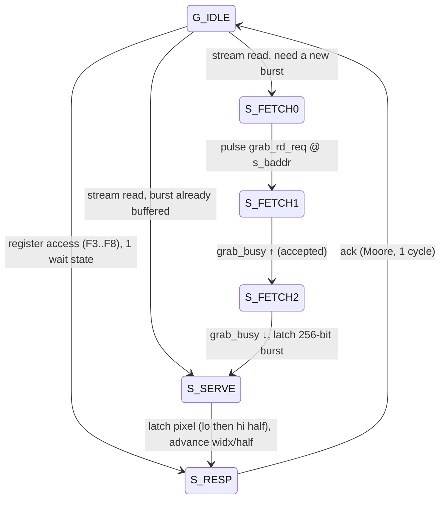

# Modbus server architecture

The board runs a **Modbus RTU slave** on the FT2232H channel-B UART so a host PC
can read/write live OV7670 registers, poll status, and grab full camera frames.
This document covers the RTL that implements it — `modbus_rtu_slave.sv` (the
protocol engine) and the **Wishbone bus** behind it (`modbus_cam_backend.sv` as the
composition root, a `wb_interconnect`, and four peripheral slaves) — their state
machines, and how they connect to the rest of the design.

For the host-facing register map and usage, see
[host_control.md](host_control.md). For the channel-1 capture/stream hardware
the bus drives, see [video_datapath.md](video_datapath.md).

## Block diagram

Everything here runs in the **27 MHz `sys_clk`** domain. Only `psram_ch1`
crosses into the PSRAM `fb_clk` domain (handled internally by toggle CDCs).



`modbus_cam_backend.sv` keeps the same module name and port list it always had,
but it is now a **thin composition wrapper**: internally it renames the slave's
`be_*` handshake to a Wishbone master and instantiates the interconnect + four
slaves. So `camera_control.v` and the integration test
[`sim/integration/modbus/cam_bridge.sv`](../sim/integration/modbus/cam_bridge.sv)
are unchanged across the refactor, and that test doubles as a byte-identical
regression of the register map.

The init FSM inside `camera_control.v` owns the SCCB controller during power-on
register load; once it reaches `TRANSMIT_COMPLETE` it latches
`cam_init_complete`, which (a) hands the `i2c_control_fsm` inputs over to the bus
via an ownership mux, and (b) lets `wb_sccb` service camera-register accesses.
Status, grab, stream, and OSD accesses are served regardless of init state.

## `modbus_rtu_slave.sv` — the protocol engine

Sits directly on `uart.sv`. Implements Modbus-over-serial RTU for a block of
16-bit holding registers:

| FC     | Function                | Notes                                        |
| ------ | ----------------------- | -------------------------------------------- |
| `0x03` | Read Holding Registers  | up to `MAX_QTY` (127) registers per request  |
| `0x06` | Write Single Register   | low byte reaches the camera                  |
| `0x10` | Write Multiple Registers| request bounded by `MAX_FRAME` (32)          |

Framing is by the **t3.5 silent interval** (a frame ends after ≥3.5 character
times of RX idle). CRC-16/Modbus (poly `0xA001`, init `0xFFFF`, LSB-first) is
checked on RX (a good frame CRCs to 0) and appended on TX. Bad CRC, wrong
address, parity error, or overflow → the frame is silently dropped. Address 0 is
broadcast (writes applied, no reply). Exceptions: `0x01` illegal function,
`0x02` illegal data address, `0x03` illegal data value.

### Pluggable register backend (`be_*`)

The protocol FSM never touches register storage directly — it issues a generic
**backend handshake** and stalls for `be_ready`:

```
be_req, be_we, be_addr, be_wdata   →   (backend)   →   be_ready, be_rdata
```

- `EXTERNAL_BACKEND = 0` (default): a tiny internal single-cycle RAM backend
  (used by the unit test) — `be_ready` the next cycle.
- `EXTERNAL_BACKEND = 1` (the real design): the Wishbone bus answers, taking
  as long as it needs (an SCCB cycle, or a PSRAM burst). The FSM simply waits.

This handshake is exactly a **Wishbone B4 classic-standard** single-access cycle —
one outstanding access, the master stalls until `ack`, wait states are free. So
`modbus_cam_backend` renames it 1:1 with no adapter logic:

| `be_*` (slave side) | Wishbone master |
| ------------------- | --------------- |
| `be_req`            | `cyc & stb`     |
| `be_we`             | `we`            |
| `be_addr[15:0]`     | `adr`           |
| `be_wdata[15:0]`    | `dat_w`         |
| `be_ready`          | `ack`           |
| `be_rdata[15:0]`    | `dat_r`         |

### State machine



**Two-stage decode (S_CHECK → S_DECIDE).** All the heavy arithmetic — the 16-bit
address+quantity adds, the `> REG_COUNT` / `> MAX_QTY` bounds compares, the
validity OR — lands in registers in `S_CHECK`. `S_DECIDE` is then only a shallow
mux on those flags into the response and next state. This keeps the path into
`state` short at 27 MHz.

**Response storage split (the BSRAM trick).** A full FC03 response can be up to
the protocol max of 127 registers (254 payload bytes). Holding that in
flip-flops would cost thousands of FFs, so:

- the **header / echo** (≤6 bytes: dev, func, byte-count, or the FC06/FC10 echo,
  or an exception) lives in `resp_hdr[0:5]` flip-flops;
- the **FC03 data payload** lives in `pay_ram`, a 16-bit-wide inferred **BSRAM**
  (`MAX_QTY` deep) written one register per `S_RD_CAP` iteration and read back
  synchronously during TX.

Because the BSRAM read is registered (one-cycle latency), `S_TX_SETUP` inserts a
settle cycle before each `S_TX_LOAD` so `pay_rdata` matches the current byte
index. `S_TX_LOAD` sources each TX byte from the header FFs for `tidx < hdr_len`,
from `pay_ram` (hi byte at even offset, lo at odd) for the payload, then the two
CRC bytes.

This is what lets one FC03 carry 127 pixels of a frame download while the design
stays well under the fabric budget (the payload maps to one block RAM; see
[video_datapath.md](video_datapath.md) for why a big burst matters).

## The Wishbone bus (`modbus_cam_backend.sv`)

`modbus_cam_backend.sv` was once one monolithic FSM that bundled five jobs behind
the `be_*` handshake. It is now a thin wrapper around a Wishbone B4
classic-standard bus: the `be_*`-as-master nets feed `wb_interconnect.sv`, which
address-decodes to **four independent, individually-testable slaves**. Each
concern lives in its own file, and each has its own unit test (see
[testing.md](testing.md)).

### `wb_interconnect.sv` — address decode + muxing

Purely combinational: one master, four slaves. It decodes `wb_adr_i` into one
mutually-exclusive per-slave strobe and muxes `dat_r` / `ack` back. The register
map is byte-identical to before, so the decode uses **explicit constants for the
scattered `0xFx` block** (never ranges — `F0/F1/F2/F9/FA` go to sysregs while
`F3..F8` go to grab):

| Address(es)                       | Slave         |
| --------------------------------- | ------------- |
| `0x0000..0x00C9`                  | `wb_sccb`     |
| `0xF0, F1, F2, F9, FA`            | `wb_sysregs`  |
| `0xF3..F8` and (read) `≥ 0x1000`  | `wb_grab`     |
| `0xFB, FC, FD`                    | `wb_osd`      |
| anything else (`0xCA..EF`, `FE/FF`, `0x100..0xFFF`, stream-band writes) | **default: ack with `dat_r = 0`** |

The default-ack arm is essential: an unmapped address still acks (returning 0), so
the master never hangs — preserving the old monolith's `default` behaviour. Since
the master holds the address stable for the whole access, the combinational decode
is glitch-free for a classic-standard cycle.

### `wb_sccb.sv` — camera registers (`0x00..0xC9`) → live SCCB

Drives the existing `i2c_control_fsm` exactly the way the power-on init FSM does
(`store_data` held across the two stores for a write; a single store for a read):

- **Write** (`we=1`): `W_STORE_ADDR → W_STORE_VAL → W_STORE_DONE → W_SEND →
  W_SEND_CLR → W_WAIT_RDY` — store the register index then the value, pulse
  `send_data`, wait for `device_rdy`.
- **Read** (`we=0`): `R_STORE_ADDR → R_STORE_DONE → R_STORE_WAIT → R_RECV →
  R_RECV_CLR → R_WAIT_VALID` — store the index, pulse `recv_data`, wait
  `data_valid`, return `{8'h00, data_out}`.

It is **gated by `cam_init_complete`**: a camera access holds `ack` low (the master
stalls) until power-on init has released the SCCB bus. Because the interconnect
masks an unselected slave's ack, a status/grab/OSD access still completes during
init — only the camera access waits. This is a multi-cycle slave; `ack` is a Moore
output asserted for one cycle in the final `S_RESP` state.

### `wb_sysregs.sv` — status registers (`0xF0/F1/F2/F9/FA`)

Single-cycle (`ack = stb & cyc`, combinational `dat_o`). Houses the free-running
uptime counter, independent of the bus:

| Addr        | Action                                                          |
| ----------- | --------------------------------------------------------------- |
| `0xF0`      | read firmware magic `0xA5`                                       |
| `0xF1/0xF2` | read uptime hi/lo (a hi read latches the counter for a coherent pair) |
| `0xF9`      | read watchdog health `{monitoring, any_hang, cam, mem, lcd}` (from `wd_health`, see [video_datapath.md](video_datapath.md#health-watchdog)) |
| `0xFA`      | write 1 = reset to defaults — pulse `cam_reinit`, restarting the camera init FSM in `camera_control.v` (re-walks the ROM like power-on) |

### `wb_grab.sv` — frame grab + stream (`0xF3..F8`, `≥0x1000`)

Two response timings behind one slave. The register accesses (`F3..F8`) are a fixed
one-wait-state path; a **stream read** (`≥0x1000`) is the
[frame download](video_datapath.md#frame-grab-and-host-download) fast path, keeping
a stream pointer and a 256-bit burst buffer:

| Addr        | Action                                                          |
| ----------- | --------------------------------------------------------------- |
| `0xF3`      | write 1 = arm a grab; write 2 = single-word ch1 read; read = `{calib,busy}` |
| `0xF4/0xF5` | write the single-read ch1 address lo/hi (debug)                 |
| `0xF6/0xF7` | read the single-read ch1 word hi/lo halves (debug)              |
| `0xF8`      | write = rewind the download stream pointer to pixel 0           |
| `≥0x1000` (read) | return the next 16-bit frame pixel, advance the pointer    |



While fetching a burst the slave **holds `ack` low** (classic-standard wait states),
so the master simply stalls — the same back-pressure the old monolith got from
withholding `be_ready`. At the end of an 8-word burst the pointer advances
(`s_baddr += 16`) and the buffer is marked empty, so the next pixel triggers a
fresh `S_FETCH0`. Each `psram_ch1` read returns a full **8-word (16-pixel) burst**,
so the slave hits PSRAM once per 16 pixels and serves the rest from `s_burst`; the
host issues back-to-back FC03s from `0x1000` to pull the whole frame.

### `wb_osd.sv` — OSD text overlay (`0xFB/FC/FD`)

Single-cycle on the bus; a second always block runs the cursor / clear-sweep /
char-buffer write port (verbatim from the old monolith):

| Addr   | Action                                                                |
| ------ | --------------------------------------------------------------------- |
| `0xFB` | write bit0 = `osd_enable`, bit1 = clear-buffer sweep; read bit0 = enable (see [video_datapath.md](video_datapath.md#osd-text-overlay)) |
| `0xFC` | write OSD cursor (`row*60 + col`); read = current cursor              |
| `0xFD` | write character code at the cursor, or read it back; cursor auto-increments (wraps at 1020) |

A `0xFB` clear pulse triggers a hardware sweep that blanks all 1020 cells and homes
the cursor; the write port drives `osd_wr_en/addr/data` into the dual-clock
character buffer in `OSDOverlay`. A `0xFD` **read** returns the glyph at the cursor
via a second (registered) read port on the char buffer (`osd_rb_addr`/`osd_rb_data`),
so it takes one bus wait-state — handled by a small `G_IDLE → G_CAP → G_RESP` FSM
in `wb_osd` — then auto-increments the cursor like a write, letting a host read a
run of cells back to back.

**OSD burst-read band (`0x0800`–`0x0FFF`).** The interconnect routes *reads* in
this band to `wb_osd`, where they behave exactly like a `0xFD` read (glyph at the
cursor + auto-increment). Because they are consecutive register *addresses*, a
single FC03 of up to 127 registers reads 127 cells in one Modbus transaction (the
address value is ignored; the cursor walks), so a host reads the whole 60×17
buffer in ~9 transactions instead of 1020 single `0xFD` reads. This mirrors the
frame-grab stream band (`≥ 0x1000` → `wb_grab`); a write in the band is unowned
and default-acked.

## Connections summary

The wrapper's external ports are unchanged, so the connections to the rest of the
design are the same — only the internal owner (which slave) differs:

| Signal group                                            | Between                                  |
| ------------------------------------------------------- | ---------------------------------------- |
| `tx_*` / `rx_*`                                         | `uart.sv` ↔ `modbus_rtu_slave`           |
| `be_req/we/addr/wdata` → `be_ready/rdata` (= Wishbone master) | `modbus_rtu_slave` ↔ `modbus_cam_backend` (`wb_interconnect`) |
| `store_data/send_data/recv_data/i2c_din` → `device_rdy/data_valid/i2c_dout` | `wb_sccb` ↔ `i2c_control_fsm` (muxed with the init FSM by `cam_init_complete`) |
| `grab_arm/grab_rd_req/grab_rd_addr` → `grab_busy/grab_rd_data[255:0]/grab_calib` | `wb_grab` ↔ `VGA_timing` → `psram_ch1` |
| `osd_enable/osd_wr_en/osd_wr_addr/osd_wr_data` | `wb_osd` → `VGA_timing` → `OSDOverlay` |
| `cam_reinit`, `wd_health`                              | `wb_sysregs` ↔ `camera_control.v` / `VGA_timing` |

All of the above are on `sys_clk`. The grab signals cross into the PSRAM
`fb_clk` domain inside `psram_ch1` via toggle handshakes (req toggle + 2–3-FF
sync + edge detect), so the bus never sees the crossing. The OSD char-buffer
write port crosses into `screen_clk` through `OSDOverlay`'s dual-clock RAM, and
`osd_enable` through a `CDC_Bit_Synchronizer`.
