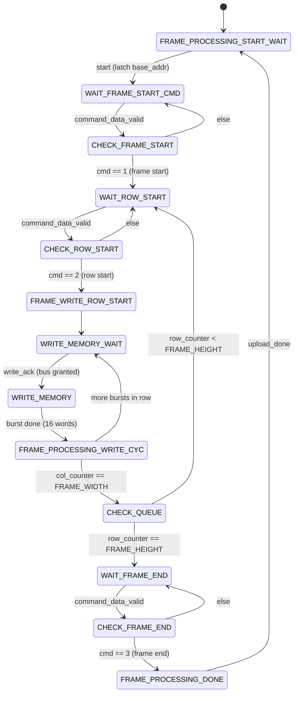
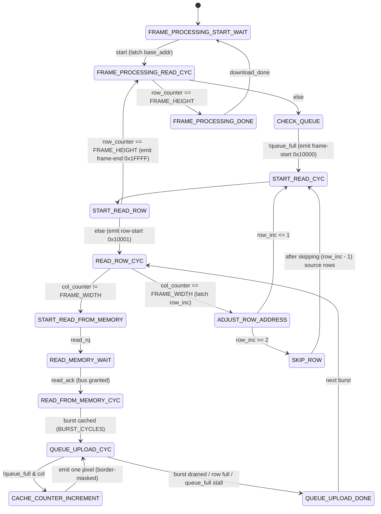

# Frame uploader / downloader state machines

The two FSMs that flank PSRAM are the heart of the frame buffer. Their
*names follow the memory's perspective* (easy to flip mentally — check the
port list before wiring tests):

- **`FrameUploader`** ([`src/fsms/FrameUploader.sv`](../src/fsms/FrameUploader.sv))
  — camera → PSRAM. Drains the camera-side FIFO and **writes** a 640×480
  RGB565 frame into a free slot.
- **`FrameDownloader`** ([`src/fsms/FrameDownloader.sv`](../src/fsms/FrameDownloader.sv))
  — PSRAM → LCD. **Reads** a frame back out, applies vertical resize +
  pillarbox borders, and pushes it toward the LCD FIFO.

Both run on `fb_clk` (67.5 MHz) inside
[`video_controller.sv`](../src/video_controller.sv); see
[architecture.md](architecture.md) for the surrounding data flow.

## Shared conventions

| Mechanism | Uploader | Downloader |
| --- | --- | --- |
| **Kick-off** | `start` pulse from VideoController's `UPLOADING_*` FSM | `start` from the `DOWNLOADING_*` FSM |
| **Completion** | `upload_done` | `download_done` |
| **Frame slot** | `base_addr` (from `BufferController` via VideoController) | `base_addr` |
| **PSRAM bus** | request `write_rq`, wait for grant `write_ack` (from `arbiter`) | request `read_rq`, wait for grant `read_ack` |
| **Burst** | `MEMORY_BURST` = 32 B = 16 RGB565 words | same |
| **Back-pressure** | n/a (reads its FIFO on demand) | stalls on `queue_full` from the store FIFO |

Two distinct **command-token** vocabularies appear:

- On the **capture** side, `cam_pixel_processor` sends 2-bit `command_data`
  to the uploader: **1 = frame start, 2 = row start, 3 = frame end**. The
  uploader acks each with `read_rdy`.
- On the **display** side, the downloader emits 17-bit tokens into the store
  FIFO (bit 16 = command flag): **`0x10000` = frame start, `0x10001` = row
  start, `0x1FFFF` = frame end**; data pixels are `{1'b0, rgb565}`. The
  `lcd_controller` consumes these.

---

## FrameUploader

Synchronises to the camera's command stream, then writes each active row
into PSRAM as a sequence of 16-word bursts. Pixels come from the load FIFO
(`pixel_data`), addressed by `pixel_addr = col_counter[10:1]` (two pixels
per 32-bit word).

| State | Role |
| --- | --- |
| `FRAME_PROCESSING_START_WAIT` | Idle. On `start`, latch `base_addr` → `frame_addr`, clear `row_counter`. |
| `WAIT_FRAME_START_CMD` / `CHECK_FRAME_START` | Consume command tokens until the **frame-start (1)** marker arrives. |
| `WAIT_ROW_START` / `CHECK_ROW_START` | Wait for the next **row-start (2)** marker before writing a row. |
| `FRAME_WRITE_ROW_START` | Reset `col_counter` / `write_cyc_counter` for the row. |
| `WRITE_MEMORY_WAIT` | Assert `write_rq`; advance once the arbiter returns `write_ack`. |
| `WRITE_MEMORY` | Drive the burst: pulse `mem_wr_en`/`write_addr`, step `col_counter` by 2 (two pixels/word). `CACHE_DELAY = 2` cycles compensate the BSRAM registered-output latency. After `BURST_CYCLES`, bump `frame_addr += 16`. |
| `FRAME_PROCESSING_WRITE_CYC` | Honour the burst-command spacing (`TCMD + CACHE_DELAY`). If the row is finished (`col_counter == FRAME_WIDTH`) bump `row_counter` and go to `CHECK_QUEUE`; otherwise issue the next burst. |
| `CHECK_QUEUE` | Row-loop dispatcher: more rows → `WAIT_ROW_START`; last row done → `WAIT_FRAME_END`. |
| `WAIT_FRAME_END` / `CHECK_FRAME_END` | Wait for the **frame-end (3)** marker. |
| `FRAME_PROCESSING_DONE` | Pulse `upload_done`, bump `frame_counter`, return to idle. |

---

## FrameDownloader

Reads the frame back out one row at a time: request the bus, pull a 16-word
burst into the row cache, then stream the cache into the store FIFO. It also
performs the **vertical resize** (480 → 272) and the **pillarbox borders**.

| State | Role |
| --- | --- |
| `FRAME_PROCESSING_START_WAIT` | Idle. On `start`, latch `base_addr` → `frame_addr_counter`, clear `row_counter`. |
| `FRAME_PROCESSING_READ_CYC` | Per-row gate: if all rows done → `FRAME_PROCESSING_DONE`, else reset the cache and proceed. Folds the row-address adder result back into `frame_addr_counter`. |
| `CHECK_QUEUE` | On the first pass, emit the **frame-start** token `0x10000` (when the FIFO has room). |
| `START_READ_CYC` → `START_READ_ROW` | Per-row entry. `START_READ_ROW` emits the **row-start** token `0x10001`, or the **frame-end** token `0x1FFFF` after the last row. |
| `READ_ROW_CYC` | Row loop. While `col_counter != FRAME_WIDTH`, fetch another burst (`START_READ_FROM_MEMORY`). When the row is complete, latch `row_inc = row_inc_o` (from `PositionScaler_vert`), bump `row_counter`, set the row address step, and go to `ADJUST_ROW_ADDRESS`. |
| `START_READ_FROM_MEMORY` → `READ_MEMORY_WAIT` | Assert `read_rq`; advance on the arbiter `read_ack`, latching the read address. |
| `READ_FROM_MEMORY_CYC` | Capture `BURST_CYCLES` words from `rd_data` into the row cache (`Gowin_SDPB_DN`). |
| `QUEUE_UPLOAD_CYC` | Drain dispatcher. Stall while `queue_full`; otherwise step a pixel (`CACHE_COUNTER_INCREMENT`) until the burst is exhausted or the row is full, then `QUEUE_UPLOAD_DONE`. |
| `CACHE_COUNTER_INCREMENT` | Emit one output pixel and advance `col_counter`/`cache_addr`. **Pillarbox masking** (resize only): columns outside `[BORDER_SIZE, RESIZED_WIDTH + BORDER_SIZE)` are written as black `0x00000`; inside, the cached pixel passes through 1:1. |
| `QUEUE_UPLOAD_DONE` | Fold the consumed `cache_addr` back into the frame address; loop to `READ_ROW_CYC` for the next burst. |
| `ADJUST_ROW_ADDRESS` / `SKIP_ROW` | **Vertical resize**: `PositionScaler_vert` returns `row_inc` ∈ {1, 2} per output row; `SKIP_ROW` advances `frame_addr_counter` by `ORIG_FRAME_WIDTH` for each extra source row to drop (480 → 272 downscale). |
| `FRAME_PROCESSING_DONE` | Pulse `download_done`, return to idle. |

### Resize / pillarbox notes

- **Vertical** downscale (480 → 272) is live, driven by `PositionScaler_vert`
  + the `ADJUST_ROW_ADDRESS`/`SKIP_ROW` row skipping.
- **Horizontal** is currently *borders only* (no downscale): the read path is
  unchanged (full `FRAME_WIDTH` 1:1), and `CACHE_COUNTER_INCREMENT` blanks the
  `BORDER_SIZE` columns on each side, giving a 362-wide active band centred on
  screen (`RESIZED_WIDTH = ⌊FRAME_HEIGHT · 640/480⌋ = 362`, `BORDER_SIZE = 59`).
  `PositionScaler_horz` is **not** instantiated (`if (0)` guard) so it isn't
  synthesised as dead logic on the `fb_clk` critical path.
- `WRITE_NEAREST_PIXEL` exists in the state enum but is unused (reserved for a
  future horizontal-scaling mode).

The structure and pixel mapping are covered by the
`integration/pillarbox/*` and `integration/frame_roundtrip/*` testbenches —
see [testing.md](testing.md).
