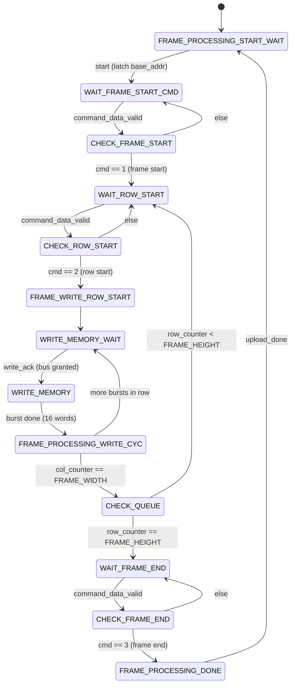
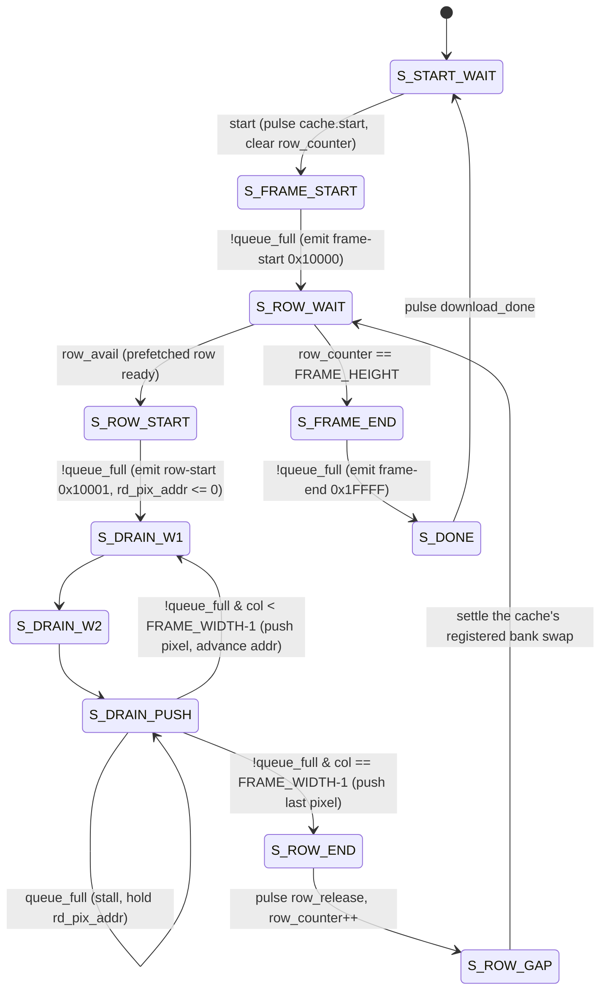

# Frame uploader / downloader state machines

The two FSMs that flank PSRAM are the heart of the frame buffer. Their
*names follow the memory's perspective* (easy to flip mentally — check the
port list before wiring tests):

- **`FrameUploader`** ([`src/fsms/FrameUploader.sv`](../src/fsms/FrameUploader.sv))
  — camera → PSRAM. Drains the camera-side FIFO and **writes** a 640×480
  RGB565 frame into a free slot.
- **`FrameDownloader`** ([`src/fsms/FrameDownloader.sv`](../src/fsms/FrameDownloader.sv))
  — PSRAM → LCD. A thin **sequencer + drain**: it seeds the prefetch cache,
  emits the frame/row/end tokens, and drains pixels toward the store FIFO.
  The actual PSRAM reads, the two ping-pong row banks and the source-row
  addressing (incl. **vertical resize**) live in its helper
  **`DownloadRowCache`** ([`src/DownloadRowCache.sv`](../src/DownloadRowCache.sv)).
  Horizontal **pillarbox borders** are applied further downstream by
  `HorizontalResizer`, not here.

Both run on `fb_clk` (67.5 MHz) inside
[`video_controller.sv`](../src/video_controller.sv); see
[architecture.md](architecture.md) for the surrounding data flow.

## Shared conventions

| Mechanism | Uploader | Downloader |
| --- | --- | --- |
| **Kick-off** | `start` pulse from VideoController's `UPLOADING_*` FSM | `start` from the `DOWNLOADING_*` FSM |
| **Completion** | `upload_done` | `download_done` |
| **Frame slot** | `base_addr` (from `BufferController` via VideoController) | `base_addr` |
| **PSRAM bus** | request `write_rq`, wait for grant `write_ack` (from `arbiter`) | request `read_rq`, wait for grant `read_ack` |
| **Burst** | `MEMORY_BURST` = 32 B = 16 RGB565 words | same |
| **Back-pressure** | n/a (reads its FIFO on demand) | stalls on `queue_full` from the store FIFO |

Two distinct **command-token** vocabularies appear:

- On the **capture** side, `cam_pixel_processor` sends 2-bit `command_data`
  to the uploader: **1 = frame start, 2 = row start, 3 = frame end**. The
  uploader acks each with `read_rdy`.
- On the **display** side, the downloader emits 17-bit tokens into the store
  FIFO (bit 16 = command flag): **`0x10000` = frame start, `0x10001` = row
  start, `0x1FFFF` = frame end**; data pixels are `{1'b0, rgb565}`. The
  `lcd_controller` consumes these.

---

## FrameUploader

Synchronises to the camera's command stream, then writes each active row
into PSRAM as a sequence of 16-word bursts. Pixels come from the load FIFO
(`pixel_data`), addressed by `pixel_addr = col_counter[10:1]` (two pixels
per 32-bit word).

| State | Role |
| --- | --- |
| `FRAME_PROCESSING_START_WAIT` | Idle. On `start`, latch `base_addr` → `frame_addr`, clear `row_counter`. |
| `WAIT_FRAME_START_CMD` / `CHECK_FRAME_START` | Consume command tokens until the **frame-start (1)** marker arrives. |
| `WAIT_ROW_START` / `CHECK_ROW_START` | Wait for the next **row-start (2)** marker before writing a row. |
| `FRAME_WRITE_ROW_START` | Reset `col_counter` / `write_cyc_counter` for the row. |
| `WRITE_MEMORY_WAIT` | Assert `write_rq`; advance once the arbiter returns `write_ack`. |
| `WRITE_MEMORY` | Drive the burst: pulse `mem_wr_en`/`write_addr`, step `col_counter` by 2 (two pixels/word). `CACHE_DELAY = 2` cycles compensate the BSRAM registered-output latency. After `BURST_CYCLES`, bump `frame_addr += 16`. |
| `FRAME_PROCESSING_WRITE_CYC` | Honour the burst-command spacing (`TCMD + CACHE_DELAY`). If the row is finished (`col_counter == FRAME_WIDTH`) bump `row_counter` and go to `CHECK_QUEUE`; otherwise issue the next burst. |
| `CHECK_QUEUE` | Row-loop dispatcher: more rows → `WAIT_ROW_START`; last row done → `WAIT_FRAME_END`. |
| `WAIT_FRAME_END` / `CHECK_FRAME_END` | Wait for the **frame-end (3)** marker. |
| `FRAME_PROCESSING_DONE` | Pulse `upload_done`, bump `frame_counter`, return to idle. |

---

## FrameDownloader

A thin **sequencer + drain**. On `start` it pulses `DownloadRowCache`'s `start`
(seeding `base_addr`), emits the **frame-start** token, then for each of
`FRAME_HEIGHT` output rows it waits for the cache to prefetch a row
(`row_avail`), emits a **row-start** token, drains `FRAME_WIDTH` pixels into the
store FIFO, and releases the bank — finally emitting the **frame-end** token and
pulsing `download_done`. It owns no PSRAM logic; `read_rq`/`read_addr`/
`mem_rd_en` are driven straight from the cache.

Each drained pixel takes a fixed 3-state cadence (`S_DRAIN_W1` → `S_DRAIN_W2` →
`S_DRAIN_PUSH`): the two wait states cover the `sdpb_1kx32` registered-output
latency (`CACHE_DELAY = 2`). Because `rd_pix_addr` is held stable across them,
the high/low 16-bit half-select on the cache read port is purely combinational.

| State | Role |
| --- | --- |
| `S_START_WAIT` | Idle. On `start`, pulse `cache.start` (seeds `base_addr`), clear `row_counter`. |
| `S_FRAME_START` | Emit the **frame-start** token `0x10000` once the FIFO has room. |
| `S_ROW_WAIT` | Per-row gate: all rows done (`row_counter == FRAME_HEIGHT`) → `S_FRAME_END`; otherwise wait for the cache's `row_avail` (front bank holds a complete row). |
| `S_ROW_START` | Emit the **row-start** token `0x10001`; reset `col_counter` and `rd_pix_addr`. |
| `S_DRAIN_W1` / `S_DRAIN_W2` | Two wait cycles covering the `sdpb_1kx32` 2-cycle read latency for the addressed pixel. |
| `S_DRAIN_PUSH` | Push `{1'b0, rd_pix_data}` to the FIFO. Stalls (holding `rd_pix_addr`) while `queue_full`. On the last column → `S_ROW_END`; otherwise advance `rd_pix_addr`/`col_counter` and loop to `S_DRAIN_W1`. |
| `S_ROW_END` | Pulse `row_release` (free the drained bank), bump `row_counter`. |
| `S_ROW_GAP` | One cycle so the cache's *registered* front-bank swap / `bank_full` clear settle before `S_ROW_WAIT` re-samples `row_avail`. |
| `S_FRAME_END` | Emit the **frame-end** token `0x1FFFF`. |
| `S_DONE` | Pulse `download_done`, return to idle. |

---

## DownloadRowCache

The prefetch engine behind `FrameDownloader`. It owns the PSRAM read path and
two `sdpb_1kx32` row banks used **ping-pong**: while one bank drains out the read
port, the other is filled from PSRAM. Seeded by `start` + `base_addr`, it
autonomously walks the frame — reading `FRAME_WIDTH` pixels per output row in
`MEMORY_BURST` chunks (`BURSTS_PER_ROW` bursts) and auto-incrementing the
source-row base — so the next row's read latency overlaps the current row's
drain. This mirrors the upload-side `row_a`/`row_b` ping-pong in
[`cam_pixel_processor.sv`](../src/cam_pixel_processor.sv) and does **not**
increase total PSRAM read bandwidth.

The drain side runs in parallel with the fill FSM, in the same `always` block
(single-owner `bank_full` — no cross-process race): on each `row_release` it
clears the front bank's full flag and flips `front_bank`.

```mermaid
stateDiagram-v2
    state "F_IDLE" as FIDLE
    state "F_REQ" as FREQ
    state "F_WAIT" as FWAIT
    state "F_DATA" as FDATA
    state "F_DONE" as FDONE

    [*] --> FIDLE
    FIDLE --> FIDLE: !active (idle until start) / both banks full
    FIDLE --> FDONE: active & rows_fetched == FRAME_HEIGHT (clear active)
    FIDLE --> FREQ: active & fill bank free (latch row_base, reset counters)
    FREQ --> FWAIT: assert read_rq
    FWAIT --> FDATA: read_ack (pulse mem_rd_en; read_addr held = burst addr)
    FDATA --> FREQ: burst done & not last (advance addr += PIX_PER_BURST)
    FDATA --> FIDLE: last burst of row (publish bank, swap fill_bank, step row base by stride)
    FDONE --> FIDLE: start (reseed for next frame)
```

| State | Role |
| --- | --- |
| `F_IDLE` | Idle unless `active`. Stays idle until `FrameDownloader` pulses `start` (sets `active`) — so **no PSRAM reads issue after reset, between frames, or during the PSRAM controller's power-on calibration**. When `active`: all rows fetched → `F_DONE` (clear `active`); fill bank free → start a row (latch `row_base`, clear `wr_word`/`burst_in_row`) → `F_REQ`; both banks full → stall here until a `row_release`. |
| `F_REQ` | Assert `read_rq`. |
| `F_WAIT` | Wait for the arbiter `read_ack`, then pulse `mem_rd_en` for one cycle. `read_addr` (= `cur_addr`) is held = this burst's address so the PSRAM command latches it correctly; the address advance happens *after* the burst. |
| `F_DATA` | Capture `BURST_CYCLES` words from `read_data` into the fill bank (write-enable on `rd_data_valid`). On the last burst of a row: set `bank_full[fill_bank]`, flip `fill_bank`, bump `rows_fetched`, and step the source-row base by `stride_rows · ORIG_FRAME_WIDTH`. Otherwise advance `cur_addr += PIX_PER_BURST` and fetch the next burst. |
| `F_DONE` | All rows fetched; idle until the next `start`. |

### Resize / pillarbox notes

- **Vertical** downscale (480 → 272) lives in `DownloadRowCache`: a
  `PositionScaler_vert` DDA returns `position_increment` ∈ {1, 2} per fetched
  output row, and the cache steps the source-row base by
  `stride_rows · ORIG_FRAME_WIDTH` (so it skips the dropped source rows). With
  `ENABLE_RESIZE = 0` the stride is a constant `ORIG_FRAME_WIDTH` (one source
  row per output row; if `EMIT_ROW_SIZE < ORIG_FRAME_WIDTH` that is a leftmost
  crop).
- The per-row read/emit width is `EMIT_ROW_SIZE` (640 = full row); it is
  decoupled from `FRAME_WIDTH` (the nominal LCD output width).
- **Horizontal** pillarbox is applied **downstream by `HorizontalResizer`**, not
  in `FrameDownloader`/`DownloadRowCache`: those emit a plain `EMIT_ROW_SIZE`-wide
  row, and `HorizontalResizer` downscales it to the active band and adds the
  `BORDER_SIZE` black columns on each side (362-wide active band centred on a
  480-wide line). See [`src/resize/HorizontalResizer.sv`](../src/resize/HorizontalResizer.sv).

The structure and pixel mapping are covered by the
`integration/pillarbox/*` and `integration/frame_roundtrip/*` testbenches, and
the FSMs themselves by the `unit/download_row_cache/*` and
`unit/frame_downloader/*` testbenches — see [testing.md](testing.md).
