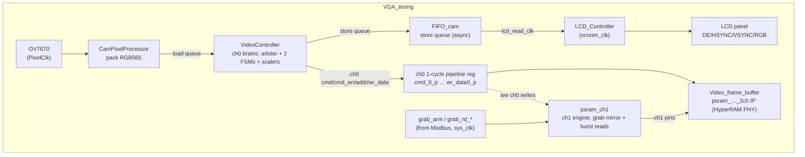
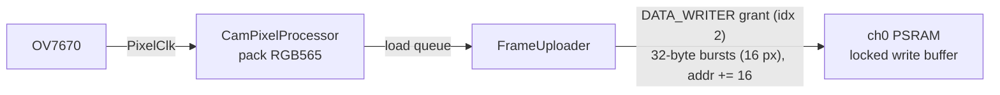
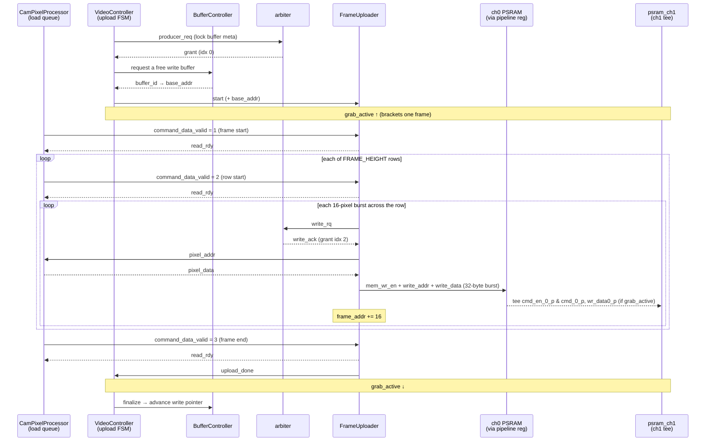
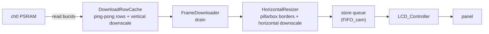
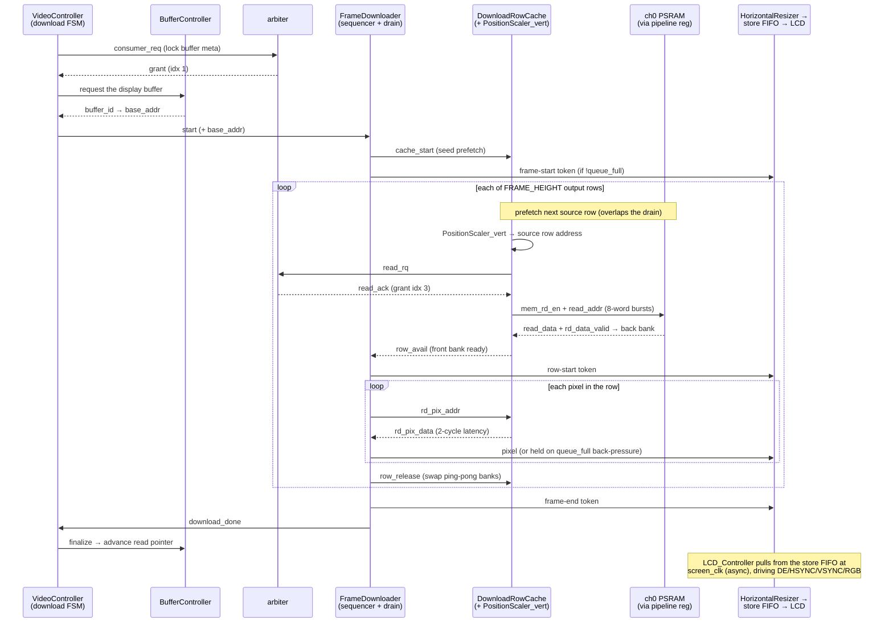
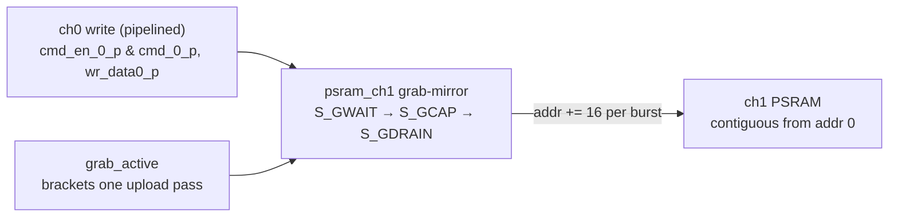
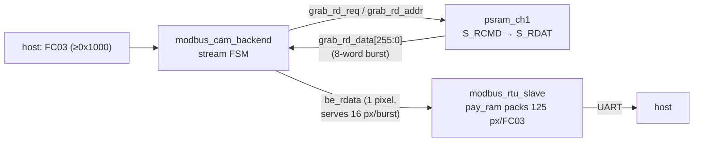
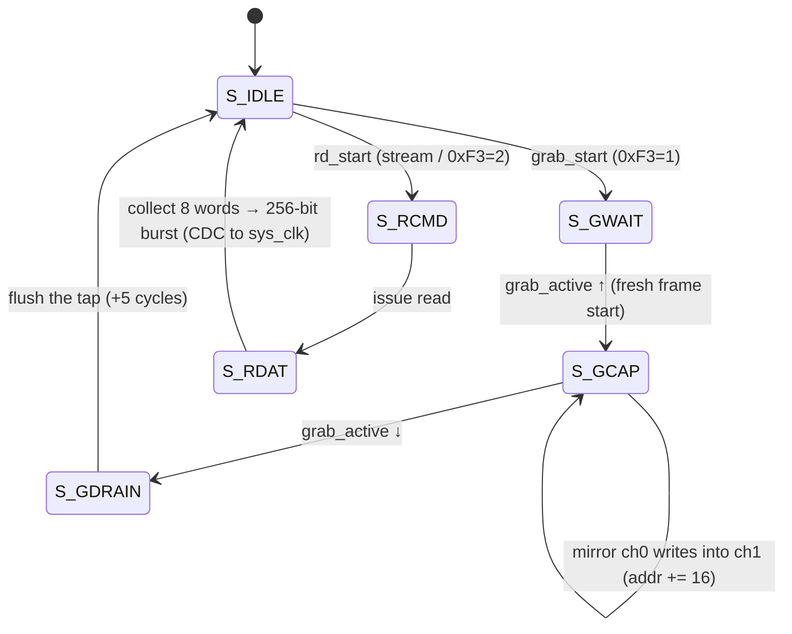

# Video datapath (`VGA_timing`) and PSRAM channels

`VGA_timing.v` is the container for the whole real-time video path and the
frame-grab hardware. It owns the dual-channel HyperRAM PHY and wires together the
camera-capture path, the LCD-display path, and the channel-1 frame-grab/readout
engine. This document describes the modules inside it, how the on-chip arbiter
mediates PSRAM access, the camera-write "DMA", and the host frame-download path.

Related: [modbus_server.md](modbus_server.md) (the host side that drives the
grab), and the high-level [architecture.md](architecture.md).

## Clocks

| Clock        | Freq      | Drives                                               |
| ------------ | --------- | ---------------------------------------------------- |
| `sys_clk`    | 27 MHz    | Modbus/UART/I2C, the `psram_ch1` control side        |
| `memory_clk` | 135 MHz   | HyperRAM PHY                                         |
| `clk_2`      | ~67.5 MHz | **fb_clk** — PHY user clock (`clk_out`); all ch0 video logic + `psram_ch1` PHY side |
| `PixelClk`   | —         | OV7670 pixel clock (camera byte stream in)           |
| `screen_clk` | 13.5 MHz  | LCD pixel clock                                      |

`clk_2` is generated *by* the PSRAM IP and is the heartbeat of the video logic.

## Modules inside `VGA_timing`



- **`Video_frame_buffer`** — the Gowin `psram_memory_interface_hs_2ch` IP, the
  dual-channel HyperRAM PHY. It produces `clk_2` and per-channel
  `init_calib0/1`, `rd_data0/1`, `rd_data_valid0/1`, and accepts per-channel
  `cmd*/cmd_en*/addr*/wr_data*/data_mask*`. **Channel 0** is the live video frame
  buffer; **channel 1** is exclusively the frame-grab engine's. The IP arbitrates
  the shared DQ pins between the two channels internally.
- **ch0 pipeline register** (`cmd_0_p`, `cmd_en_0_p`, `addr0_p`, `wr_data0_p`,
  `data_mask_0_p`) — a single register stage on `clk_2` between `VideoController`
  and the IP. It exists to break the original fb_clk critical path (the
  combinational route from `FrameUploader.mem_wr_en` to the IP's many WRE pins).
  It uniformly delays every ch0 transaction by one `clk_2` cycle, which the FSMs
  absorb because they gate on grant / `rd_data_valid`, not absolute cycle counts.
  **Keep this stage** when refactoring the memory-bus side. The frame-grab tap
  reads these *pipelined* signals (see below).
- **`VideoController`** — the ch0 "brains": owns the channel-0 pins, the on-chip
  arbiter, the upload/download FSMs, the resize, and the 3-frame circular buffer
  bookkeeping. Detailed below.
- **`FIFO_cam` (store queue)** — an async FIFO (17-bit) crossing from `clk_2`
  (VideoController's store side) to `lcd_read_clk` (LCD side). Decouples the
  PSRAM-paced read path from the LCD pixel clock.
- **`CamPixelProcessor`** — packs the OV7670 8-bit byte stream (on `PixelClk`,
  framed by `v_sync`/`h_ref`) into RGB565 pixels and feeds the VideoController
  "load queue" that `FrameUploader` drains. (`DebugPatternGenerator2` can replace
  it under ``DEBUG_CAM_INPUT`` for bring-up.)
- **`LCD_Controller`** — generates the 480×272 VGA timing on `screen_clk`, pulls
  pixels from the store FIFO, and drives `LCD_DE/HSYNC/VSYNC/R/G/B`.
- **`psram_ch1`** — the channel-1 engine: the grab-mirror, the ch1 burst reader,
  and the `sys_clk ↔ fb_clk` CDC. Detailed under
  [frame grab](#frame-grab-and-host-download).

## Inside `VideoController`: the arbiter and the two FSMs

`VideoController` runs entirely on `clk_2` and mediates all channel-0 PSRAM
traffic through one round-robin **`arbiter`** (`src/arbiter.v`, laforest;
`NUM_DEVICES = 4`). There are four requesters, two per FSM:

| Index | `req` signal     | Requester / purpose                                  |
| ----- | ---------------- | ---------------------------------------------------- |
| 0     | `producer_req`   | `FrameUploader` — buffer-metadata lock (via `BufferController`) |
| 1     | `consumer_req`   | `FrameDownloader` — buffer-metadata lock              |
| 2     | `data_write_req` | `FrameUploader` — actual PSRAM **write** bursts       |
| 3     | `data_read_req`  | `FrameDownloader` — actual PSRAM **read** bursts      |

```
shared_req   = {data_read_req, data_write_req, consumer_req, producer_req}
shared_grant = arbiter(shared_req)         // round-robin, may take a few cycles
```

Two independent FSMs sequence the work:

- **`uploading_state`** (`UPLOADING_*`): wait out the post-calibration delay →
  `LOCK_BUFFER` (take grant idx 0, ask `BufferController` for a free write
  buffer) → `SELECT_BUFFER` (latch its base address) → `START_PROCESS_FRAME`
  (kick `FrameUploader`) → `FRAME_DONE_WAIT` → `RELEASE_BUFFER`.
- **`downloading_state`** (`DOWNLOADING_*`): the mirror image for reads — locks a
  full buffer (grant idx 1), kicks `FrameDownloader`, releases it.

While a frame is moving, the uploader/downloader stream bursts by raising
`data_write_req`/`data_read_req` (idx 2/3) and acting on the grant. The
channel-0 command pins are a simple mux of the two FSMs' addresses:

```
cmd    = mem_wr_en                       // 1 = write, 0 = read
cmd_en = mem_wr_en | mem_rd_en
addr   = cmd ? write_addr_o : read_addr_o
```

`BufferController` owns the **3-frame circular buffer** policy (skip-frame when
the writer outruns the reader, repeat-frame when the reader outruns the writer);
the FSMs lock/finalize buffers through it, and `get_base_addr()` maps a buffer
index to its PSRAM base.

## Camera-write path (the "DMA into PSRAM")

The name follows the memory's perspective — `FrameUploader` uploads pixel data
*into* PSRAM:



`FrameUploader` writes whole 32-byte HyperRAM bursts (16 RGB565 pixels) and
advances the address by 16 per burst. `VideoController` asserts **`grab_active`**
for the full duration of one upload pass (set on `start_uploading`, cleared on
`upload_done`); that flag is what the channel-1 grab uses to bracket exactly one
frame.

The load queue is coordinated by **command tokens**: `CamPixelProcessor` raises
`command_data_valid` with `command_data` = 1 (frame start), 2 (row start), or 3
(frame end), and `FrameUploader` acks each with `read_rdy`. Pixels themselves sit
in a row buffer that the uploader reads by driving `pixel_addr` and latching
`pixel_data`. Each burst is gated by an arbiter round-trip (`write_rq` →
`write_ack`). The full per-frame communication sequence:



## LCD-display path

`FrameDownloader` reads frames back out toward the LCD. It is a thin
sequencer + drain over **`DownloadRowCache`** (instantiated inside it), a
ping-pong double-buffered row prefetch cache that owns the PSRAM reads and the
**vertical** resize addressing (`PositionScaler_vert` sets the per-row source
stride). It prefetches the next row while the current one drains, so reads
overlap the LCD-paced consumption.



`HorizontalResizer` adds the pillarbox borders and the horizontal downscale on
the output pixel stream (transparent/1:1 when resize is disabled). The result
feeds the store FIFO, which `LCD_Controller` drains at `screen_clk`. The resize
geometry (input/screen size, `EMIT_ROW_SIZE`) comes from `platform.json` via
`platform_config.vh`.

Like the write path, the read side uses **command tokens** (frame-start /
row-start / frame-end) into the store queue, with `read_rdy`-style back-pressure
via `queue_full`. The key difference is the **prefetch/drain overlap**:
`DownloadRowCache` reads the *next* source row from PSRAM (its own arbiter read
grant, vertical-resize addressing) while the FSM drains the *current* row's front
bank, then `row_release` swaps the ping-pong banks. The per-frame communication
sequence (the inner read prefetch overlaps the drain shown beside it):



## Frame grab and host download

Channel 1 lets a host capture and download a full 640×480 frame independently of
the live LCD path. It is driven by `modbus_cam_backend` (see
[modbus_server.md](modbus_server.md)) through `VGA_timing`'s `grab_*` ports.

### Capture — tee the ch0 write stream into ch1

There is **no copy through the arbiter** (all four arbiter slots are already in
use). Instead `psram_ch1` *tees* the channel-0 write stream and mirrors it into
channel 1:



- A host write of `1` to register `0xF3` arms the grab. `psram_ch1` waits in
  `S_GWAIT` for a **rising edge** of `grab_active` (a *fresh* frame start — a
  level check would capture only the tail of a frame already in flight), then in
  `S_GCAP` copies every ch0 write burst onto the ch1 pins, laying the frame out
  contiguously from ch1 address 0. `S_GDRAIN` flushes the registered tap, and a
  watchdog bounds the whole thing so a never-arriving frame can't wedge `busy`.
- Because it mirrors the already-pipelined ch0 stream, the grab costs **no extra
  PSRAM read bandwidth** and needs no arbiter changes.

### Download — burst reads streamed over Modbus



`psram_ch1`'s read path (`S_RCMD → S_RDAT`) issues one ch1 read and collects all
8 returned words into a 256-bit register, exposed as `grab_rd_data[255:0]` (CDC'd
to `sys_clk` on the completion toggle). The backend buffers that burst and serves
16 pixels (8 words × low/high half) before fetching the next, and the slave packs
up to 125 pixels per FC03 response out of BSRAM. A full 640×480 frame
(307,200 px, ~614 KB) downloads in ~10 s at 1 Mbaud.

The same `grab_rd_*` interface also backs the single-word debug read at
registers `0xF4`–`0xF7` (it just returns word 0 of the addressed burst).

### `psram_ch1` state machine



CDC between the `sys_clk` control side (Modbus) and the `fb_clk` PHY side uses
toggle handshakes: a request toggle is set on `grab_arm`/`rd_req`, synchronized
with 2–3 flops on `fb_clk`, and edge-detected to start the op; a completion
toggle returns the other way to clear `busy` and latch the result. `calib1`
(ch1 calibrated) is likewise synced out as `grab_calib`.
