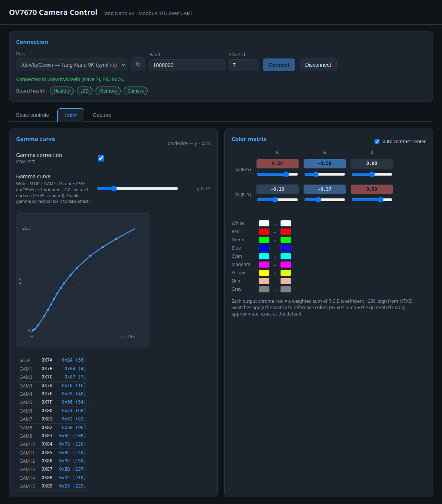
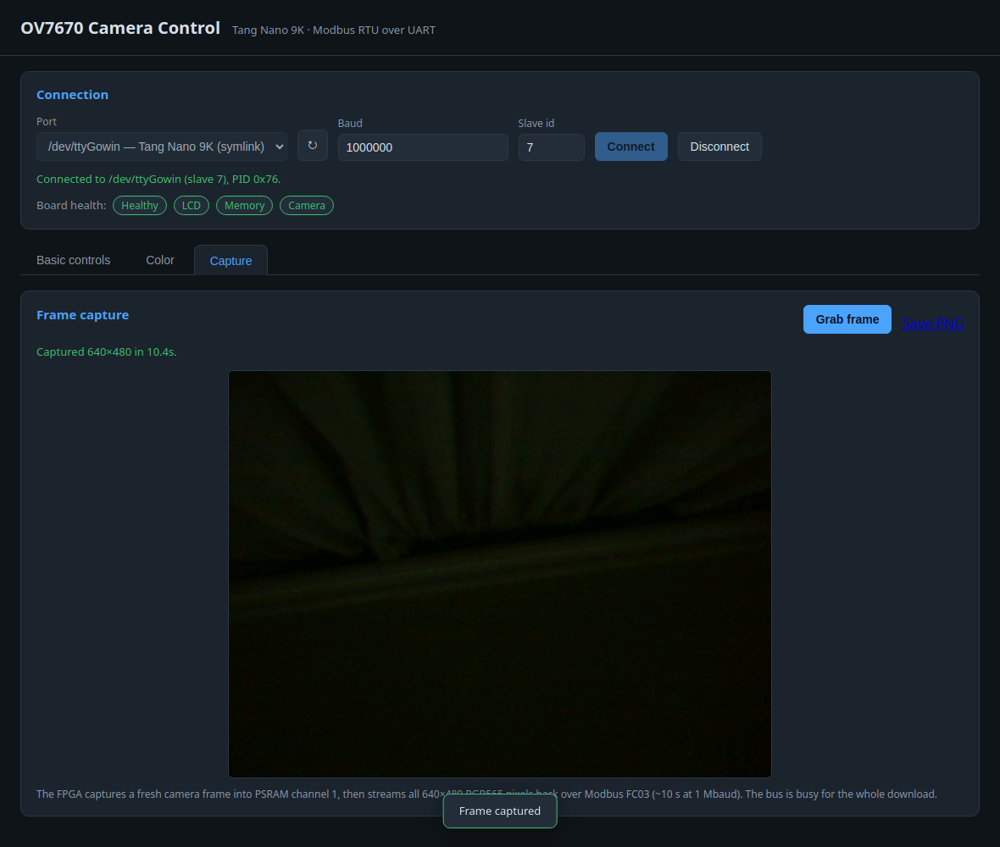

# Web app manual

The bundled Flask web app ([`webapp/`](../webapp/)) is a point-and-click panel
for the FPGA's Modbus camera bridge: connect to the board, tune the OV7670 live,
watch board health, and grab full frames. It talks to the device exactly like
the CLI — Modbus RTU over the FT2232H UART — so anything here can also be scripted
(see [host_control.md](host_control.md)).

## Running it

```sh
python3 -m venv .venv && .venv/bin/pip install -r webapp/requirements.txt
.venv/bin/python webapp/app.py            # then open http://127.0.0.1:5000
```

The serial device must be readable/writable by your user; the project's udev rule
exposes it as a stable `/dev/ttyGowin` (see [host_control.md](host_control.md)).

## Connecting

Pick the serial **Port** (auto-detected, plus the `/dev/ttyGowin` symlink), set
**Baud** (1000000) and **Slave id** (7), and press **Connect**. The connect step
sanity-reads the Product ID, so a successful connect confirms the link end-to-end.

Once connected, three tabs appear (**Basic controls**, **Color**, **Capture**)
and a **Board health** row is shown under the connection status.


### Board health

The health row decodes the watchdog register (`0xF9`), refreshed by a background
heartbeat:

- **overall** chip — *Healthy* (green), *HANG* (red), or *starting…* while the
  watchdog is still in its startup grace;
- **LCD / Memory / Camera** chips — green when that subsystem's heartbeat is
  alive, red if it has latched a hang.

This mirrors the on-board debug LED (blinks when healthy, solid-on on a hang).
See [host_control.md](host_control.md#board-health-watchdog) for the bit layout.

## Basic controls

| Area | What it does |
| ---- | ------------ |
| **Camera identity** | Read-only PID / VER / MIDH / MIDL with a ✓ when they match the expected OV7670 values. |
| **Raw register access** | Read or write any OV7670 register by hex address. **Dump registers** downloads all of `0x00`–`0xC9` as a JSON file (`{ "description": …, "registers": { "0x00": "0x1F", … } }`). **Reset to defaults** re-runs the power-on init (reloads every register from ROM). |
| **Controls** | Sliders (brightness, contrast, gain, exposure) and a test-pattern selector on the left; checkboxes (AGC / AWB / AEC, mirror / flip, negative, night mode) on the right. Each change is a live SCCB write. **Reload values** re-reads the device. |

## Color



- **Gamma curve** — an enable toggle (COM13[7]) plus a γ-exponent slider that
  regenerates SLOP + GAM1–GAM15 from one exponent. The live SVG plot shows the
  resulting curve and the knee points; the table lists the register values.
- **Color matrix** — the 2×3 chroma matrix (MTX1–6 with signs from MTXS) as a
  signed heat-map grid with per-cell sliders and an *auto contrast-center*
  toggle. The reference-color swatches show each input color mapped through the
  current matrix (approximate; exact at the default).

## Capture



**Grab frame** captures a fresh 640×480 frame into PSRAM channel 1 and streams it
back over Modbus (~10 s at 1 Mbaud). A progress popup shows download progress
with a **Cancel** button; when it finishes the frame is drawn to the canvas and a
**Save PNG** link appears. The bus is busy for the whole download. See
[video_datapath.md](video_datapath.md#frame-grab-and-host-download) for how the
capture/stream works in hardware.

## Resilience

A heartbeat polls the device every few seconds. If the board is reset (its
uptime counter jumps backward) the UI resyncs the register state; if the serial
port disappears the app shows a banner and auto-reconnects when it returns. A
grabbed frame is cleared on disconnect, and a fresh connection lands on the
**Basic controls** tab.
